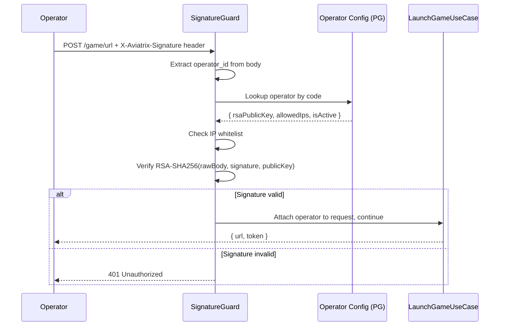
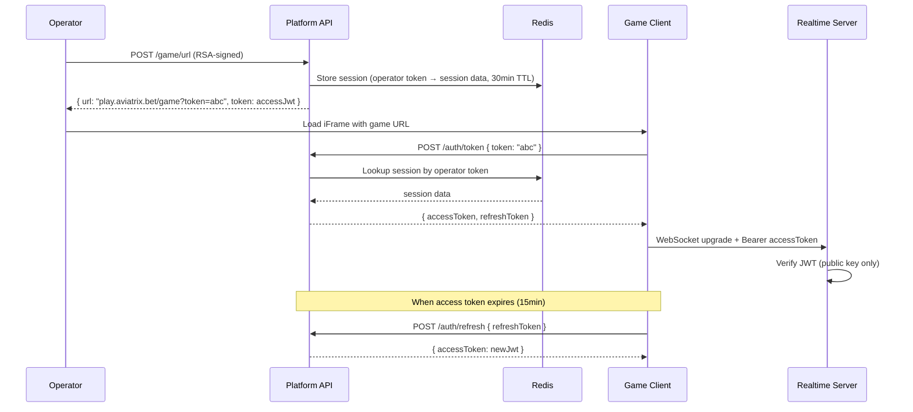
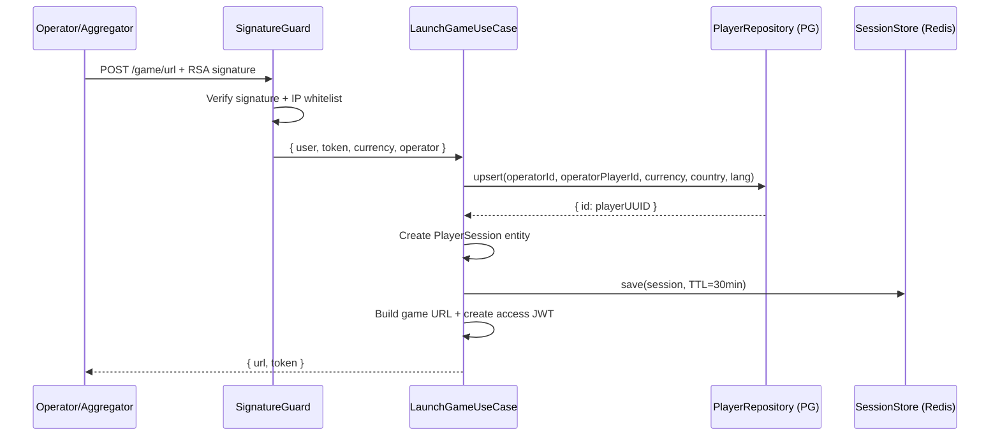
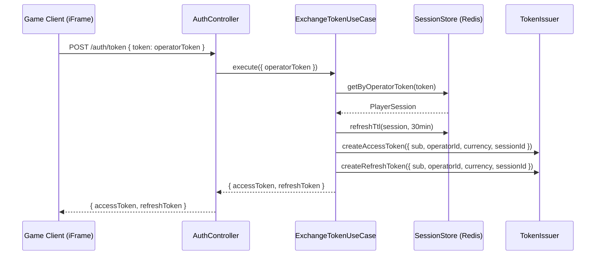
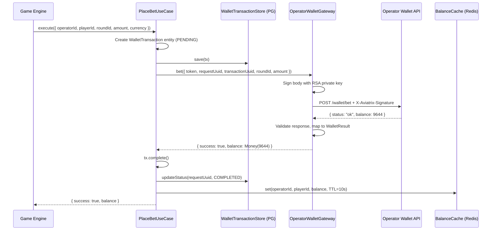
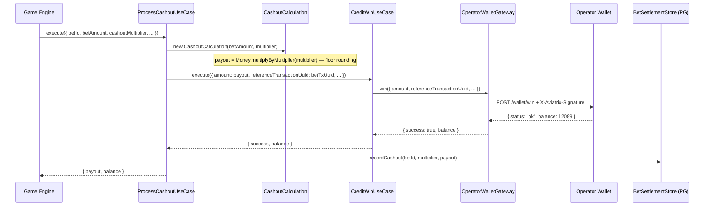
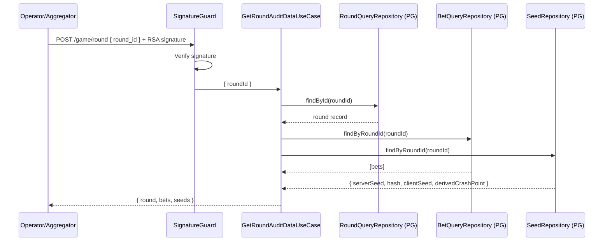

# Platform API Architecture Plan (Clean Architecture + NestJS)

## 1. Context

The Platform API is the **operator-facing gateway** of the Aviatrix crash gaming platform. It sits between casino operators/aggregators and the internal game engine, handling:

- **Game launch** — Operators call `POST /game/url` with RSA-signed requests to create player sessions and receive a game URL for iFrame embedding
- **Session management** — Token exchange (operator token → internal JWT), refresh, and session state in Redis
- **Wallet orchestration** — Proxying bet/win/rollback transactions between the game engine and operator wallet APIs using the industry-standard seamless wallet protocol
- **Persistence** — Recording rounds, bets, wallet transactions, and provably fair seed audit logs to PostgreSQL
- **History & verification** — Exposing paginated game history and provably fair verification data to players and operators

The current implementation (`feat/platform-api-core-modules`) is a working NestJS application using Fastify, Drizzle ORM, and undici connection pools. However, it mixes domain logic, persistence, and HTTP concerns within NestJS `@Injectable()` services. This document defines the **target clean architecture** for each bounded context and provides concrete migration steps from the current code to the target state.

### Key Architectural Decisions

- **Role**: Shared multi-tenant gateway (unlike the operator-siloed game engine). Routes by `operatorId` extracted from JWT or request body.
- **B2B Auth**: RSA-SHA256 request-body signing for Game API endpoints (industry standard — Hub88, St8 pattern). No OAuth2 for B2B server-to-server calls.
- **Player Auth**: HS256 JWT with access/refresh token pair for client-facing endpoints. Asymmetric RS256/EdDSA for realtime-server (holds public key only).
- **Wallet Protocol**: Seamless wallet — the operator is the single source of truth for player balances. Aviatrix calls `/wallet/bet`, `/wallet/win`, `/wallet/rollback` on the operator's API.
- **ORM**: Drizzle ORM over TypeORM — type-safe, SQL-close, no decorator magic in domain layer.
- **HTTP**: Fastify over Express — 2-3x throughput for JSON serialization on the wallet hot path.
- **Wallet HTTP Client**: undici connection pools — HTTP/1.1 keep-alive with configurable concurrency per operator.
- **Validation**: TypeBox (compile-time JSON Schema) over class-validator — no decorator metadata, works outside NestJS.
- **Money**: Decimal(18,4) in PostgreSQL, string transport between services. Integer-scaled arithmetic in CashoutService for payout calculation. Target: adopt the game engine's `Money` value object (integer cents) across the board.

---

## 2. Clean Architecture Audit of Current Code

The current PR has all logic in `@Injectable()` NestJS services with direct Drizzle/Redis calls. This table maps violations to fixes.

| Rule | Severity | Violation (Current) | Fix (Target) |
|------|----------|---------------------|--------------|
| `dep-inward-only` | CRITICAL | `AuthService` imports Drizzle, Redis, `TokenService` directly | Domain `Session` entity + `SessionStore` port; `AuthService` becomes a use case with injected ports |
| `dep-no-framework-imports` | CRITICAL | All business logic lives in `@Injectable()` services | Domain + application layer classes are plain TypeScript; NestJS decorators only in infrastructure |
| `entity-pure-business-rules` | CRITICAL | No domain entities — `WalletService.placeBet()` mixes validation, HTTP calls, and DB writes | Create `WalletTransaction`, `Operator`, `PlayerSession` domain entities with encapsulated rules |
| `frame-domain-purity` | HIGH | Drizzle schema objects used as both DB schema and domain types | Separate domain types from Drizzle schema; map at infrastructure boundary |
| `usecase-input-output-ports` | HIGH | No input/output ports — controllers call services directly | Define `LaunchGameUseCase`, `ExchangeTokenUseCase`, `PlaceBetUseCase` with typed commands/results |
| `comp-screaming-architecture` | HIGH | Flat NestJS module structure (`auth/`, `wallet/`, `round/`) | Add `domain/`, `application/`, `infrastructure/` sublayers within each module |
| `adapt-anti-corruption-layer` | HIGH | `GenericSeamlessAdapter` returns raw operator JSON without validation | Validate operator wallet responses against a schema; map to domain `WalletResult` type |
| `adapt-gateway-abstraction` | MEDIUM | `WalletService` calls `AdapterFactory` and `DbService` in same method | `WalletGateway` port in application layer; `WalletService` becomes infrastructure adapter |
| `entity-value-objects` | MEDIUM | Amounts passed as strings (`"100.50"`), no type safety | Adopt `Money` value object from `shared/kernel/` (integer cents) |
| `frame-di-container-edge` | MEDIUM | `@Inject(REDIS_CLIENT)` scattered across services | Redis access only in infrastructure adapters; application layer uses port interfaces |

---

## 3. Monorepo Position

```
igame-monorepo/
├── apps/
│   ├── game-engine/           ← Bun.js crash engine (per operator)
│   ├── realtime-server/       ← uWebSockets + NATS bridge (per operator)
│   ├── platform-api/          ← NestJS gateway (THIS SERVICE — shared, multi-tenant)
│   ├── frontend/              ← React 19 + Vite (CDN)
│   └── docs-hosted/           ← Static docs
├── packages/
│   └── shared/                ← Protobuf schemas, shared kernel (Money, DomainError)
└── infrastructure/
```

### Target Internal Architecture

```
apps/platform-api/
├── src/
│   ├── main.ts                                    # Fastify bootstrap (composition root)
│   ├── app.module.ts                              # NestJS wiring only
│   │
│   ├── auth/                                      # ── AUTH BOUNDED CONTEXT ──
│   │   ├── domain/
│   │   │   ├── PlayerSession.ts                   # Entity: session state + expiry rules
│   │   │   ├── OperatorToken.ts                   # Value object: operator-issued token
│   │   │   └── LaunchRequest.ts                   # Value object: validated launch params
│   │   ├── application/
│   │   │   ├── ports/
│   │   │   │   ├── SessionStore.ts                # Port: Redis session CRUD
│   │   │   │   ├── PlayerRepository.ts            # Port: player upsert
│   │   │   │   ├── SessionRepository.ts           # Port: PG session audit
│   │   │   │   └── TokenIssuer.ts                 # Port: JWT sign/verify
│   │   │   ├── LaunchGameUseCase.ts               # Orchestrates game launch
│   │   │   ├── ExchangeTokenUseCase.ts            # Operator token → JWT pair
│   │   │   ├── RefreshTokenUseCase.ts             # Refresh access token
│   │   │   └── commands/
│   │   │       ├── LaunchGameCommand.ts           # Input DTO
│   │   │       ├── LaunchGameResult.ts            # Output DTO
│   │   │       ├── ExchangeTokenCommand.ts
│   │   │       └── ExchangeTokenResult.ts
│   │   └── infrastructure/
│   │       ├── auth.module.ts                     # NestJS wiring
│   │       ├── auth.controller.ts                 # Thin HTTP adapter
│   │       ├── RedisSessionStore.ts               # Implements SessionStore
│   │       ├── DrizzlePlayerRepository.ts         # Implements PlayerRepository
│   │       ├── DrizzleSessionRepository.ts        # Implements SessionRepository
│   │       └── guards/
│   │           └── SignatureGuard.ts              # RSA verification (infrastructure)
│   │
│   ├── wallet/                                    # ── WALLET BOUNDED CONTEXT ──
│   │   ├── domain/
│   │   │   ├── WalletTransaction.ts               # Entity: tx lifecycle (PENDING→COMPLETED/FAILED)
│   │   │   ├── WalletTransactionStatus.ts         # Enum
│   │   │   ├── WalletTransactionType.ts           # Enum: BET | WIN | ROLLBACK
│   │   │   └── WalletResult.ts                    # Value object: success/failure union
│   │   ├── application/
│   │   │   ├── ports/
│   │   │   │   ├── OperatorWalletGateway.ts       # Port: HTTP calls to operator
│   │   │   │   ├── WalletTransactionStore.ts      # Port: PG tx persistence
│   │   │   │   └── BalanceCache.ts                # Port: Redis balance cache
│   │   │   ├── PlaceBetUseCase.ts                 # Debit → record → update cache
│   │   │   ├── CreditWinUseCase.ts                # Credit → record → update cache
│   │   │   ├── RollbackBetUseCase.ts              # Rollback → record
│   │   │   ├── GetBalanceUseCase.ts               # Cache-first balance query
│   │   │   └── commands/
│   │   │       ├── PlaceBetCommand.ts
│   │   │       ├── PlaceBetResult.ts
│   │   │       ├── CreditWinCommand.ts
│   │   │       └── CreditWinResult.ts
│   │   └── infrastructure/
│   │       ├── wallet.module.ts
│   │       ├── adapters/
│   │       │   ├── AdapterFactory.ts              # Resolves operatorId → adapter
│   │       │   ├── GenericSeamlessAdapter.ts       # undici pool + RSA signing
│   │       │   ├── Hub88Adapter.ts                # Hub88-specific (Int64 amounts, X-Hub88-Signature)
│   │       │   └── SoftSwissAdapter.ts            # SoftSwiss-specific (token exchange auth)
│   │       ├── DrizzleWalletTransactionStore.ts
│   │       └── RedisBalanceCache.ts
│   │
│   ├── round/                                     # ── ROUND BOUNDED CONTEXT ──
│   │   ├── domain/
│   │   │   └── RoundRecord.ts                     # Entity: persisted round state
│   │   ├── application/
│   │   │   ├── ports/
│   │   │   │   ├── RoundRepository.ts             # Port: CRUD + current round
│   │   │   │   └── RoundCache.ts                  # Port: Redis current round
│   │   │   ├── CreateRoundUseCase.ts
│   │   │   ├── UpdateRoundStatusUseCase.ts
│   │   │   └── GetCurrentRoundUseCase.ts
│   │   └── infrastructure/
│   │       ├── round.module.ts
│   │       ├── round.controller.ts
│   │       ├── DrizzleRoundRepository.ts
│   │       └── RedisRoundCache.ts
│   │
│   ├── cashout/                                   # ── CASHOUT BOUNDED CONTEXT ──
│   │   ├── domain/
│   │   │   └── CashoutCalculation.ts              # Value object: bet × multiplier → payout
│   │   ├── application/
│   │   │   ├── ProcessCashoutUseCase.ts
│   │   │   ├── SettleLosingBetsUseCase.ts
│   │   │   └── RollbackBetUseCase.ts
│   │   └── infrastructure/
│   │       ├── cashout.module.ts
│   │       └── DrizzleBetSettlement.ts
│   │
│   ├── history/                                   # ── HISTORY BOUNDED CONTEXT ──
│   │   ├── application/
│   │   │   ├── ports/
│   │   │   │   ├── RoundQueryRepository.ts        # Port: paginated round queries
│   │   │   │   ├── BetQueryRepository.ts          # Port: paginated bet queries
│   │   │   │   └── HistoryCache.ts                # Port: Redis page cache
│   │   │   ├── GetRoundHistoryUseCase.ts
│   │   │   ├── GetPlayerBetHistoryUseCase.ts
│   │   │   └── GetRoundAuditDataUseCase.ts
│   │   └── infrastructure/
│   │       ├── history.module.ts
│   │       ├── history.controller.ts
│   │       ├── DrizzleRoundQueryRepository.ts
│   │       └── RedisHistoryCache.ts
│   │
│   ├── verification/                              # ── VERIFICATION BOUNDED CONTEXT ──
│   │   ├── application/
│   │   │   ├── ports/
│   │   │   │   └── SeedRepository.ts
│   │   │   └── GetVerificationDataUseCase.ts
│   │   └── infrastructure/
│   │       ├── verification.module.ts
│   │       ├── verification.controller.ts
│   │       └── DrizzleSeedRepository.ts
│   │
│   ├── crypto/                                    # ── SHARED INFRASTRUCTURE ──
│   │   ├── crypto.module.ts
│   │   ├── SignatureService.ts                    # RSA-SHA256 sign/verify
│   │   ├── TokenService.ts                        # fast-jwt HS256 sign/verify
│   │   └── JwtAuthGuard.ts
│   │
│   ├── db/                                        # ── SHARED INFRASTRUCTURE ──
│   │   ├── db.module.ts
│   │   ├── db.service.ts                          # Drizzle + raw pg pool
│   │   └── schema/                                # Drizzle schema definitions
│   │       ├── common.ts
│   │       ├── operators.ts
│   │       ├── players.ts
│   │       ├── player-sessions.ts
│   │       ├── rounds.ts
│   │       ├── bets.ts
│   │       ├── seed-audit-logs.ts
│   │       ├── wallet-transactions.ts
│   │       └── index.ts
│   │
│   ├── redis/                                     # ── SHARED INFRASTRUCTURE ──
│   │   └── redis.module.ts
│   │
│   └── common/
│       └── pipes/
│           └── typebox-validation.pipe.ts
│
├── drizzle.config.ts
├── package.json
└── tsconfig.json
```

---

## 4. Layer Rules

| Layer | Can Import | Cannot Import | NestJS Decorators |
|-------|------------|---------------|-------------------|
| **domain/** | Only `shared/kernel`, other domain files within same context | application, infrastructure, any npm package, Drizzle, ioredis | NONE |
| **application/** | domain, shared/kernel | infrastructure, NestJS, Drizzle, ioredis, undici | NONE |
| **infrastructure/** | domain, application, NestJS, npm packages | — | YES (`@Module`, `@Injectable`, `@Controller`) |
| **crypto/**, **db/**, **redis/** | Shared infrastructure — consumed by bounded context infrastructure layers only | — | YES |

---

## 5. Database Schema

All tables live in the `game` PostgreSQL schema. Drizzle schema definitions serve as the **infrastructure** persistence model — domain entities are separate plain TypeScript classes.

### 5.1 operators

Operator onboarding record. Stores RSA public key for signature verification, wallet API endpoint, and IP whitelist.

```typescript
// db/schema/operators.ts
operators = gameSchema.table('operators', {
  id: uuid('id').primaryKey().defaultRandom(),
  name: varchar('name', { length: 128 }).notNull(),
  code: varchar('code', { length: 64 }).unique().notNull(),     // e.g. "megacasino", "hub88-op-1"
  rsaPublicKey: text('rsa_public_key').notNull(),                // PEM-encoded RSA public key
  aviatrixPrivateKeyId: varchar('aviatrix_private_key_id', { length: 64 }), // for key rotation
  walletBaseUrl: varchar('wallet_base_url', { length: 512 }).notNull(),
  walletApiVersion: varchar('wallet_api_version', { length: 16 }).default('v1'),
  callbackUrl: varchar('callback_url', { length: 512 }),         // webhook endpoint
  allowedIps: jsonb('allowed_ips').$type<string[]>().default([]),
  currencies: jsonb('currencies').$type<string[]>().default([]),
  isActive: boolean('is_active').default(true).notNull(),
  createdAt: timestamp('created_at', { withTimezone: true }).defaultNow().notNull(),
  updatedAt: timestamp('updated_at', { withTimezone: true }).defaultNow().notNull(),
});
```

### 5.2 players

Pseudonymized player record. GDPR-minimal: only operator-assigned ID, currency, country code. No PII.

```typescript
// db/schema/players.ts — unique on (operatorId, operatorPlayerId)
players = gameSchema.table('players', {
  id: uuid('id').primaryKey().defaultRandom(),
  operatorId: uuid('operator_id').references(() => operators.id).notNull(),
  operatorPlayerId: varchar('operator_player_id', { length: 128 }).notNull(),
  currency: varchar('currency', { length: 8 }).notNull(),       // ISO 4217
  country: varchar('country', { length: 4 }),                    // ISO 3166
  language: varchar('language', { length: 8 }),                  // ISO 639-1
  lastSeenAt: timestamp('last_seen_at', { withTimezone: true }),
  createdAt, updatedAt
});
```

### 5.3 player_sessions

Audit trail for game launch sessions. Primary session state lives in Redis (TTL-based).

### 5.4 rounds

Game round persistence. Status enum: `WAITING → BETTING → FLYING → CRASHED → SETTLED`.

### 5.5 bets

Per-player bet record with status enum: `PENDING → WON | LOST`. Unique on `(roundId, operatorPlayerId)`.

### 5.6 wallet_transactions

Full audit trail of every wallet API call. Type: `BET | WIN | ROLLBACK`. Status: `PENDING → COMPLETED | FAILED | ROLLED_BACK`. Includes `requestUuid` (idempotency key) and `referenceTransactionUuid` (links WIN/ROLLBACK back to original BET).

### 5.7 seed_audit_logs

Provably fair seed data per round. `serverSeedHash` published pre-round; `serverSeed` revealed post-crash for verification.

---

## 6. Bounded Contexts

### 6.1 Auth — Game Launch & Session Management

#### Target Architecture

The auth context handles the B2B game launch handshake and the B2C session lifecycle. It owns three domain concepts:

```typescript
// auth/domain/PlayerSession.ts — pure TypeScript, zero imports
export class PlayerSession {
  constructor(
    readonly sessionId: string,
    readonly playerId: string,
    readonly operatorId: string,
    readonly operatorPlayerId: string,
    readonly operatorToken: string,
    readonly currency: string,
    readonly platform: string,
    readonly expiresAt: Date,
  ) {}

  isExpired(now: Date = new Date()): boolean {
    return now >= this.expiresAt;
  }

  /** Token validity must NOT be checked for win/rollback transactions (industry standard). */
  isValidForWalletOps(): boolean {
    return true; // session remains valid for financial settlement regardless of expiry
  }
}

// auth/domain/LaunchRequest.ts — value object
export class LaunchRequest {
  constructor(
    readonly user: string,          // operator's player ID
    readonly token: string,         // operator-issued session token
    readonly currency: string,      // ISO 4217
    readonly operatorId: string,
    readonly gameCode: string,
    readonly platform: string,
    readonly lang: string,
    readonly lobbyUrl: string,
    readonly depositUrl?: string,
    readonly country?: string,      // ISO 3166
    readonly ip?: string,
  ) {
    if (currency === 'XXX') throw new Error('Demo mode not yet supported');
    if (!user || !token) throw new Error('user and token required for real-money play');
  }
}
```

**Port interfaces:**

```typescript
// auth/application/ports/SessionStore.ts
export interface SessionStore {
  save(session: PlayerSession, ttlSeconds: number): Promise<void>;
  getByOperatorToken(token: string): Promise<PlayerSession | null>;
  refreshTtl(session: PlayerSession, ttlSeconds: number): Promise<void>;
}

// auth/application/ports/PlayerRepository.ts
export interface PlayerRepository {
  upsert(data: { operatorId: string; operatorPlayerId: string; currency: string; country?: string; language: string }): Promise<{ id: string }>;
}

// auth/application/ports/TokenIssuer.ts
export interface TokenIssuer {
  createAccessToken(payload: TokenPayload): string;
  createRefreshToken(payload: TokenPayload): string;
  verifyAccessToken(token: string): TokenPayload;
  verifyRefreshToken(token: string): TokenPayload;
}
```

**Use cases:**

```typescript
// auth/application/LaunchGameUseCase.ts — no @Injectable, no NestJS
export class LaunchGameUseCase {
  constructor(
    private readonly sessionStore: SessionStore,
    private readonly playerRepo: PlayerRepository,
    private readonly tokenIssuer: TokenIssuer,
    private readonly gameClientUrl: string,
    private readonly sessionTtlSeconds: number,
  ) {}

  async execute(command: LaunchGameCommand): Promise<LaunchGameResult> {
    const request = new LaunchRequest(command.user, command.token, command.currency, ...);
    const player = await this.playerRepo.upsert({ ... });
    const session = new PlayerSession(randomUUID(), player.id, ...);
    await this.sessionStore.save(session, this.sessionTtlSeconds);
    const accessToken = this.tokenIssuer.createAccessToken({ sub: player.id, ... });
    const url = `${this.gameClientUrl}/game?token=${encodeURIComponent(command.token)}&lang=${command.lang}`;
    return { url, token: accessToken };
  }
}
```

#### Current State (PR Code)

- `AuthService` is a single `@Injectable()` class that does everything: player upsert (Drizzle), Redis session writes, JWT creation (TokenService), URL building
- `SignatureGuard` directly queries Drizzle for operator lookup + IP whitelist check
- No domain entities — session data is a plain JSON object in Redis
- `TokenService` uses `fast-jwt` with HS256 (acceptable for dev, but production should use RS256 with key rotation)

#### Migration Steps

1. Create `auth/domain/PlayerSession.ts` and `auth/domain/LaunchRequest.ts` as pure TypeScript classes with validation
2. Extract `SessionStore` port interface from the Redis operations in `AuthService`
3. Extract `PlayerRepository` port interface from the Drizzle upsert in `AuthService`
4. Extract `TokenIssuer` port interface wrapping `TokenService`
5. Rewrite `AuthService` as `LaunchGameUseCase` (plain class, constructor-injected ports)
6. Create `ExchangeTokenUseCase` and `RefreshTokenUseCase` as separate use case classes
7. Create `RedisSessionStore`, `DrizzlePlayerRepository` as `@Injectable()` infrastructure adapters
8. Slim `AuthController` to delegate only — no logic, just parse → call use case → return
9. Wire everything in `auth.module.ts` using factory providers (same pattern as game-engine's `app.module.ts`)
10. Move `SignatureGuard`'s operator lookup to an `OperatorRepository` port; guard becomes a thin infrastructure wrapper

---

### 6.2 Wallet — Seamless Wallet Protocol

#### Target Architecture

The wallet context implements the industry-standard seamless wallet protocol. The operator is the **single source of truth** for player balances. Aviatrix makes HTTP callbacks for every financial event.

**Domain entities:**

```typescript
// wallet/domain/WalletTransaction.ts
export class WalletTransaction {
  private _status: WalletTransactionStatus;

  constructor(
    readonly id: string,
    readonly playerId: string,
    readonly operatorId: string,
    readonly type: WalletTransactionType,    // BET | WIN | ROLLBACK
    readonly requestUuid: string,            // idempotency key
    readonly transactionUuid: string,        // unique tx ID sent to operator
    readonly referenceTransactionUuid: string | null, // links WIN → BET, ROLLBACK → BET
    readonly roundId: string,
    readonly amount: Money,
    readonly currency: string,
  ) {
    this._status = WalletTransactionStatus.PENDING;
  }

  complete(): void {
    if (this._status !== WalletTransactionStatus.PENDING) throw new InvalidStateTransition();
    this._status = WalletTransactionStatus.COMPLETED;
  }

  fail(): void {
    if (this._status !== WalletTransactionStatus.PENDING) throw new InvalidStateTransition();
    this._status = WalletTransactionStatus.FAILED;
  }

  rollback(): void {
    this._status = WalletTransactionStatus.ROLLED_BACK;
  }

  get status(): WalletTransactionStatus { return this._status; }
}

// wallet/domain/WalletResult.ts
export type WalletResult =
  | { success: true; balance: Money; operatorTxId?: string }
  | { success: false; error: 'INSUFFICIENT_FUNDS' | 'PLAYER_BLOCKED' | 'TOKEN_EXPIRED'
      | 'DUPLICATE_TRANSACTION' | 'LIMIT_REACHED' | 'TIMEOUT' | 'INVALID_SIGNATURE' };
```

**Port interfaces:**

```typescript
// wallet/application/ports/OperatorWalletGateway.ts
// Anti-corruption layer — translates between domain types and operator-specific wire formats
export interface OperatorWalletGateway {
  balance(operatorToken: string): Promise<WalletResult>;
  bet(params: {
    token: string;
    requestUuid: string;
    transactionUuid: string;
    roundId: string;
    amount: Money;
    currency: string;
  }): Promise<WalletResult>;
  win(params: {
    token: string;
    requestUuid: string;
    transactionUuid: string;
    referenceTransactionUuid: string;
    roundId: string;
    amount: Money;
    currency: string;
  }): Promise<WalletResult>;
  rollback(params: {
    token: string;
    requestUuid: string;
    transactionUuid: string;
    referenceTransactionUuid: string;
    roundId: string;
  }): Promise<WalletResult>;
}

// wallet/application/ports/WalletTransactionStore.ts
export interface WalletTransactionStore {
  save(tx: WalletTransaction): Promise<void>;
  updateStatus(requestUuid: string, status: WalletTransactionStatus, operatorResponse: unknown): Promise<void>;
  findByRequestUuid(requestUuid: string): Promise<WalletTransaction | null>;
}

// wallet/application/ports/BalanceCache.ts
export interface BalanceCache {
  get(operatorId: string, playerId: string): Promise<Money | null>;
  set(operatorId: string, playerId: string, balance: Money, ttlSeconds: number): Promise<void>;
  acquireLock(operatorId: string, playerId: string, ttlSeconds: number): Promise<boolean>;
  releaseLock(operatorId: string, playerId: string): Promise<void>;
}
```

**Use case:**

```typescript
// wallet/application/PlaceBetUseCase.ts
export class PlaceBetUseCase {
  constructor(
    private readonly gateway: OperatorWalletGateway,
    private readonly txStore: WalletTransactionStore,
    private readonly balanceCache: BalanceCache,
  ) {}

  async execute(command: PlaceBetCommand): Promise<PlaceBetResult> {
    const tx = new WalletTransaction(
      randomUUID(), command.playerId, command.operatorId,
      WalletTransactionType.BET, randomUUID(), randomUUID(),
      null, command.roundId, command.amount, command.currency,
    );
    await this.txStore.save(tx);

    const result = await this.gateway.bet({
      token: command.operatorToken,
      requestUuid: tx.requestUuid,
      transactionUuid: tx.transactionUuid,
      roundId: command.roundId,
      amount: command.amount,
      currency: command.currency,
    });

    if (result.success) {
      tx.complete();
      await this.txStore.updateStatus(tx.requestUuid, tx.status, result);
      await this.balanceCache.set(command.operatorId, command.playerId, result.balance, 10);
      return { success: true, transactionUuid: tx.transactionUuid, balance: result.balance };
    } else {
      tx.fail();
      await this.txStore.updateStatus(tx.requestUuid, tx.status, result);
      return { success: false, error: result.error };
    }
  }
}
```

**Adapter Factory (infrastructure):**

The `AdapterFactory` resolves an operator ID to the correct `OperatorWalletGateway` implementation. Each operator may use a different wallet API variant. The factory caches adapter instances (connection pools are reused).

```typescript
// wallet/infrastructure/adapters/AdapterFactory.ts
@Injectable()
export class AdapterFactory {
  private readonly adapters = new Map<string, OperatorWalletGateway>();

  async getAdapter(operatorId: string): Promise<OperatorWalletGateway> {
    const cached = this.adapters.get(operatorId);
    if (cached) return cached;

    const operator = await this.operatorRepo.findById(operatorId);

    // Switch on operator config for specific protocol variants
    // e.g. Hub88 uses Int64 amounts × 100,000 and X-Hub88-Signature header
    // SoftSwiss uses token exchange auth + different endpoint paths
    // Default: GenericSeamlessAdapter (standard /wallet/bet, /wallet/win, etc.)
    const adapter = new GenericSeamlessAdapter(operator.walletBaseUrl, this.signatureService, this.privateKey);
    this.adapters.set(operatorId, adapter);
    return adapter;
  }
}
```

#### Current State (PR Code)

- `WalletService` is a 250-line `@Injectable()` class that does everything: UUID generation, PENDING tx insert (raw SQL), HTTP call via `AdapterFactory`, status update, Redis balance cache
- `GenericSeamlessAdapter` uses undici pools (good) but returns raw JSON without validation — no anti-corruption layer
- `WalletAdapter` interface exists but returns plain `{ status: string; balance: number }` — no domain error types
- `AdapterFactory` caches adapters by operator ID (good) but creates `GenericSeamlessAdapter` for all operators — no operator-specific variants
- `CashoutService` mixes payout calculation (domain logic) with DB writes and wallet HTTP calls
- Amounts are passed as strings and converted with `Number()` — no `Money` value object

#### Migration Steps

1. Create `wallet/domain/WalletTransaction.ts` as a rich entity with state machine (PENDING → COMPLETED/FAILED/ROLLED_BACK)
2. Create `wallet/domain/WalletResult.ts` as a discriminated union with typed error codes matching industry standards (Hub88 `RS_ERROR_*` equivalents)
3. Adopt the `Money` value object from `shared/kernel/` — replace all string/number amount passing
4. Extract `OperatorWalletGateway` port from the current `WalletAdapter` interface — add `Money` types, add response validation
5. Extract `WalletTransactionStore` port from the raw SQL in `DbService`
6. Extract `BalanceCache` port from the Redis operations in `WalletService`
7. Split `WalletService` into four use cases: `PlaceBetUseCase`, `CreditWinUseCase`, `RollbackBetUseCase`, `GetBalanceUseCase`
8. Add response schema validation in `GenericSeamlessAdapter` (Zod or TypeBox) — anti-corruption layer
9. Create `Hub88Adapter` and `SoftSwissAdapter` stubs with operator-specific amount encoding and header conventions
10. Move payout calculation from `CashoutService` into a `CashoutCalculation` value object using `Money.multiplyByMultiplier()`
11. Wire use cases via factory providers in `wallet.module.ts`

---

### 6.3 Rounds — Round Lifecycle Persistence

#### Target Architecture

The round context persists round state changes received from the game engine (via NATS or direct API calls). It does NOT run round logic — the game engine owns that.

```typescript
// round/domain/RoundRecord.ts
export class RoundRecord {
  constructor(
    readonly id: string,
    readonly operatorId: string,
    private _status: RoundStatus,
    readonly bettingWindowMs: number,
    private _crashPoint: string | null,
    private _startedAt: Date | null,
    private _crashedAt: Date | null,
    private _settledAt: Date | null,
    readonly createdAt: Date,
  ) {}

  static create(id: string, operatorId: string, bettingWindowMs: number): RoundRecord {
    return new RoundRecord(id, operatorId, 'WAITING', bettingWindowMs, null, null, null, null, new Date());
  }

  transitionTo(status: RoundStatus): void {
    // Enforce: WAITING → BETTING → FLYING → CRASHED → SETTLED
    const validTransitions: Record<RoundStatus, RoundStatus[]> = {
      WAITING: ['BETTING'], BETTING: ['FLYING'], FLYING: ['CRASHED'], CRASHED: ['SETTLED'], SETTLED: [],
    };
    if (!validTransitions[this._status].includes(status)) {
      throw new InvalidStateTransition(`Cannot transition from ${this._status} to ${status}`);
    }
    this._status = status;
    if (status === 'FLYING') this._startedAt = new Date();
    if (status === 'CRASHED') this._crashedAt = new Date();
    if (status === 'SETTLED') this._settledAt = new Date();
  }

  recordCrash(crashPoint: string): void {
    this._crashPoint = crashPoint;
  }
}
```

**Ports:** `RoundRepository` (CRUD), `RoundCache` (Redis current round).

#### Current State (PR Code)

- `RoundService` mixes Redis cache management, Drizzle queries, and status transition logic in a single class
- No domain entity — status transitions not validated (any status can be set)
- `recordCrashPoint` uses raw SQL (acceptable for hot path, but no domain validation)

#### Migration Steps

1. Create `round/domain/RoundRecord.ts` with state machine transition validation
2. Extract `RoundRepository` port from Drizzle queries in `RoundService`
3. Extract `RoundCache` port from Redis operations in `RoundService`
4. Split into `CreateRoundUseCase`, `UpdateRoundStatusUseCase`, `GetCurrentRoundUseCase`
5. Keep raw SQL `recordCrashPointRaw` in infrastructure adapter for hot path performance

---

### 6.4 Cashout — Settlement & Payout

#### Target Architecture

```typescript
// cashout/domain/CashoutCalculation.ts — pure value object
export class CashoutCalculation {
  readonly payout: Money;

  constructor(betAmount: Money, cashoutMultiplier: number) {
    // Integer cents × multiplier, floor rounding (house edge preserved)
    this.payout = betAmount.multiplyByMultiplier(cashoutMultiplier);
  }
}
```

**Use cases:** `ProcessCashoutUseCase` (calculates payout → delegates to `CreditWinUseCase` from wallet context → records on bet), `SettleLosingBetsUseCase` (bulk update), `RollbackBetUseCase` (delegates to wallet context).

#### Current State (PR Code)

- `CashoutService` does integer-scaled arithmetic inline (good idea, messy implementation: `Math.round(Number(amount) * 10000)`)
- Directly calls `WalletService.creditWin()` and `DbService.recordCashoutRaw()`
- No domain value object for the calculation

#### Migration Steps

1. Create `CashoutCalculation` value object using `Money.multiplyByMultiplier()`
2. Extract `ProcessCashoutUseCase` as a plain class orchestrating wallet credit + bet update
3. `SettleLosingBetsUseCase` can remain thin — delegates to a `BetSettlementStore` port (bulk SQL)
4. Wire `ProcessCashoutUseCase` to use `CreditWinUseCase` from wallet context (not `WalletService` directly)

---

### 6.5 History — Paginated Game Data

#### Target Architecture

Read-only query context. Cursor-based pagination with Redis cache for page 1. No domain entities — this is a pure query/projection context.

**Ports:** `RoundQueryRepository`, `BetQueryRepository`, `HistoryCache`.

#### Current State (PR Code)

- `HistoryService` is well-structured — cursor-based pagination, Redis cache for page 1, separate `getRoundAuditData()` for operator queries
- Main issue: Drizzle and Redis access are direct, not behind ports

#### Migration Steps

1. Extract `RoundQueryRepository`, `BetQueryRepository`, `HistoryCache` port interfaces
2. Move Drizzle queries into `DrizzleRoundQueryRepository` and `DrizzleBetQueryRepository`
3. Move Redis caching into `RedisHistoryCache`
4. `GetRoundHistoryUseCase`, `GetPlayerBetHistoryUseCase`, `GetRoundAuditDataUseCase` become thin orchestrators

---

### 6.6 Verification — Provably Fair Seed Reveal

#### Target Architecture

Read-only context. For active rounds, reveals only the `serverSeedHash` (pre-commitment). For completed rounds, reveals the full server seed for independent verification.

#### Current State (PR Code)

- `VerificationService` is clean and simple — Redis cache for immutable completed round data
- Same pattern: direct Drizzle/Redis access

#### Migration Steps

1. Extract `SeedRepository` port
2. Create `GetVerificationDataUseCase` as a plain class
3. Move Redis caching to infrastructure adapter

---

### 6.7 Player — Balance Proxy

#### Target Architecture

Thin context that delegates balance queries to the wallet context.

#### Current State (PR Code)

- `PlayerService` is already a 1-method wrapper around `WalletService.getBalance()`
- `PlayerController` retrieves operator token from Redis directly

#### Migration Steps

1. Move operator token retrieval into the `SessionStore` port (auth context)
2. `PlayerController` calls `GetBalanceUseCase` (wallet context) directly — no need for a separate `PlayerService`

---

### 6.8 Crypto — RSA Signing & JWT Tokens

#### Target Architecture

Pure shared infrastructure. Not a bounded context — it provides implementations for port interfaces defined in other contexts.

- `SignatureService` → implements signing/verification used by `SignatureGuard` and wallet adapters
- `TokenService` → implements `TokenIssuer` port defined in auth context

#### Current State (PR Code)

- `SignatureService`: Clean, RSA-SHA256, supports key rotation via array of public keys — good
- `TokenService`: Uses `fast-jwt` with HS256, enforces `algorithms: ['HS256']`, type claim discrimination (access vs refresh) — good
- `JwtAuthGuard`: Extracts Bearer token, verifies, attaches to `req.user` — clean humble object

#### Migration Steps

1. Make `TokenService` implement the `TokenIssuer` port interface
2. Consider RS256 for production (asymmetric — realtime-server only needs public key)
3. No structural changes needed — crypto is already correctly placed as shared infrastructure

---

## 7. Game API (Operator-Facing Endpoints)

These endpoints live **outside** the `/api` prefix and use **RSA-SHA256 signature authentication** instead of JWT. This follows the aggregator convention (Hub88, St8, BetConstruct) where operators authenticate every request by signing the body with their private RSA key.

### POST /game/url — Game Launch

Called by the aggregator/operator to start a game session for a player.

**Request** (RSA-signed body):
```json
{
  "user": "player-abc-123",
  "token": "f562a685-a160-4d17-876d-ab3363db331c",
  "currency": "EUR",
  "operator_id": "megacasino",
  "game_code": "aviatrix_crash",
  "platform": "GPL_DESKTOP",
  "lang": "en",
  "lobby_url": "https://megacasino.com",
  "deposit_url": "https://megacasino.com/deposit",
  "country": "EE",
  "ip": "::ffff:10.0.0.39"
}
```

**Headers:**
- `X-Aviatrix-Signature` (or `X-Hub88-Signature`, `X-Signature`): Base64-encoded RSA-SHA256 signature of the raw JSON body

**Response:**
```json
{
  "url": "https://play.aviatrix.bet/game?token=f562a685...&lang=en",
  "token": "eyJhbGciOiJIUzI1NiIs..."
}
```

### POST /game/round — Round Audit Data

Called by operators for dispute resolution or regulatory audit. Returns full round data including bets, seeds, and timestamps.

**Request** (RSA-signed body):
```json
{
  "round_id": "a1b2c3d4-...",
  "operator_id": "megacasino"
}
```

**Response:** Round record + all bets + seed audit log (server seed, hash, client seed, derived crash point).

---

## 8. Operator Integration Protocol

### 8.1 RSA-SHA256 Signature Flow

Every Game API request from an operator is authenticated via RSA-SHA256 body signing. No OAuth2, no API keys — this is the B2B iGaming industry standard.



**Key implementation details:**
- Raw body must be preserved exactly as received — Fastify's custom JSON content type parser stores `req.rawBody` before parsing
- `SignatureService.verify()` accepts an array of public keys to support key rotation (old + new key valid during transition window)
- The signature covers the **entire payload** — new fields can be added without breaking verification (St8 pattern)

### 8.2 Session Token Lifecycle

The session flow uses a **dual-token pattern** inspired by St8's security model:

1. **Operator token** (short-lived, 30min): Issued by the operator, embedded in the game URL visible to the player. Used only for initial token exchange.
2. **Internal JWT** (15min access + 7-day refresh): Issued by Platform API after token exchange. Used for all subsequent API calls and WebSocket authentication.



**Industry alignment:**
- Hub88 states token validity **must not be validated for wins and rollbacks** — these may arrive after session expiry. Our `PlayerSession.isValidForWalletOps()` always returns true for this reason.
- Demo mode (currency `"XXX"`) bypasses token and wallet flows entirely.

### 8.3 Seamless Wallet Protocol

Aviatrix implements the standard seamless wallet protocol used by Hub88, SoftSwiss, BetConstruct, and all major aggregators. Four endpoints form the universal contract:

| Endpoint | Method | Direction | Purpose |
|----------|--------|-----------|---------|
| `/wallet/balance` | POST | Aviatrix → Operator | Query player's current balance |
| `/wallet/bet` | POST | Aviatrix → Operator | Debit player's wallet (bet placement) |
| `/wallet/win` | POST | Aviatrix → Operator | Credit player's wallet (cashout payout) |
| `/wallet/rollback` | POST | Aviatrix → Operator | Reverse a previous bet transaction |

Every request is signed with Aviatrix's RSA private key (`X-Aviatrix-Signature` header). Every response returns the updated balance.

### 8.4 Idempotency & Transaction UUID Tracking

Every wallet transaction carries two UUIDs:
- **`request_uuid`** — Idempotency key. If the operator receives a duplicate `request_uuid`, it must return the same response without reprocessing.
- **`transaction_uuid`** — Unique transaction identifier. WIN and ROLLBACK transactions include a `reference_transaction_uuid` linking back to the original BET.

Both UUIDs are persisted in `wallet_transactions` for at least 4 months (industry standard retention period).

### 8.5 IP Whitelisting & Key Rotation

- Operators provide a list of allowed IPs during onboarding. `SignatureGuard` checks `X-Forwarded-For` against `operator.allowedIps`.
- Key rotation: `SignatureService.verify()` accepts an array of public keys. During rotation, both old and new keys are valid. The `aviatrixPrivateKeyId` field on the operator record tracks which Aviatrix private key was used for signing outbound requests.

### 8.6 Industry Standard Alignment

| Feature | Hub88 | SoftSwiss | St8 | Aviatrix (Target) |
|---------|-------|-----------|-----|-------------------|
| **B2B Auth** | RSA-SHA256 (`X-Hub88-Signature`) | Token exchange + IP whitelist | ECDSA prime256v1 | RSA-SHA256 (`X-Aviatrix-Signature`) + IP whitelist |
| **Amount Encoding** | Int64 × 100,000 | Decimal string | Decimal | Int64 cents (Money value object) |
| **Session Model** | Single token (no expiry for win/rollback) | Ephemeral access token | Dual token (launch + wallet) | Dual token (operator + internal JWT) |
| **Wallet Protocol** | Seamless + Transfer | Seamless | Seamless | Seamless |
| **Idempotency** | `transaction_uuid` (4-month retention) | Transaction ID | Request correlation ID | `request_uuid` + `transaction_uuid` |
| **Error Codes** | `RS_ERROR_*` string enum | Numeric codes | String enum | Typed `WalletResult` union |
| **Key Rotation** | Manual key exchange | Credential rotation | Signature covers entire payload | Array of public keys + `aviatrixPrivateKeyId` |
| **Data Minimization** | player_id, currency, country, lang | player_id, currency | player_id, currency, country | Same (GDPR-minimal) |

---

## 9. Data Flow Diagrams

### 9.1 Game Launch Flow



### 9.2 Token Exchange Flow



### 9.3 Wallet Bet Flow



### 9.4 Cashout Flow



### 9.5 Round Audit Flow



---

## 10. Security Notes

### Raw Body Preservation

RSA signature verification requires the **exact bytes** the operator signed. Fastify's default JSON parser destroys whitespace and key ordering. The custom content type parser in `main.ts` stores `req.rawBody` before parsing — `SignatureGuard` uses this for deterministic verification.

### Thundering Herd Protection on Balance Cache

When the balance cache expires, multiple concurrent requests could all hit the operator's wallet API simultaneously. `GetBalanceUseCase` uses a Redis SETNX lock (5-second TTL) so only one request calls the operator API. Others wait briefly and retry the cache.

### Token Type Enforcement

`TokenService` embeds a `type: 'access' | 'refresh'` claim in every JWT. `verifyAccessToken()` rejects refresh tokens and vice versa. This prevents refresh token reuse as an access token.

### AVIATRIX_PRIVATE_KEY Management

The RSA private key used to sign outbound wallet API requests **must** be set via `AVIATRIX_PRIVATE_KEY` in production. The application refuses to start without it. The `aviatrixPrivateKeyId` field on operator records enables key rotation — during transition, the operator accepts signatures from both old and new keys.

### Responsible Gaming Integration

Responsible gaming limits (deposit caps, loss limits, wager limits, self-exclusion) are **managed entirely at the operator level**. When a bet would violate a limit, the operator's wallet API returns an error (e.g., `RS_ERROR_LIMIT_REACHED`). The `WalletResult` union type includes `LIMIT_REACHED` so the game engine can handle the rejection gracefully without needing to know why the bet was rejected.

---

## 11. Clean Architecture Compliance

| Principle | Target State | Current State | Gap |
|-----------|-------------|---------------|-----|
| `dep-inward-only` | Domain imports nothing. Application imports domain only. | All logic in @Injectable services importing Drizzle, Redis, TokenService | HIGH — needs full layer separation |
| `dep-interface-ownership` | Ports defined in `application/ports/`, implemented in `infrastructure/` | No ports exist — services call infrastructure directly | HIGH — extract all port interfaces |
| `entity-pure-business-rules` | `PlayerSession`, `WalletTransaction`, `RoundRecord` are rich entities | No domain entities — data is plain objects | HIGH — create domain entities |
| `entity-value-objects` | `Money`, `LaunchRequest`, `CashoutCalculation` are value objects | Amounts are strings, no domain validation | MEDIUM — adopt Money from shared kernel |
| `frame-domain-purity` | Zero framework imports in domain + application layers | Everything uses NestJS decorators | HIGH — remove decorators from business logic |
| `bound-humble-object` | Controllers are thin — parse, delegate, return | Controllers do some validation and error mapping | LOW — controllers are already fairly thin |
| `adapt-anti-corruption-layer` | Wallet adapter validates operator responses via schema | Raw JSON returned from operator without validation | MEDIUM — add response validation |
| `comp-screaming-architecture` | Folder structure says "auth, wallet, rounds" with domain/application/infra sublayers | Module folders exist but no internal layering | MEDIUM — add sublayer directories |
| `test-layer-isolation` | Domain tests run without NestJS, application tests mock ports | No tests yet | HIGH — add tests at each layer |

---

## 12. Implementation Tasks

### Phase PA-1: Domain Entities & Shared Kernel

| ID | Task | Files | Acceptance Criteria | Deps | Size |
|----|------|-------|---------------------|------|------|
| PA-1.1 | Import `Money` value object from shared kernel | `packages/shared/kernel/Money.ts`, adapt import in platform-api | `Money.fromCents()`, `Money.multiplyByMultiplier()` used in wallet + cashout contexts; all string amounts replaced | — | S |
| PA-1.2 | Create `PlayerSession` entity | `src/auth/domain/PlayerSession.ts`, test | Pure class with expiry check, `isValidForWalletOps()` always true; zero imports | — | S |
| PA-1.3 | Create `LaunchRequest` value object | `src/auth/domain/LaunchRequest.ts`, test | Validates required fields; rejects demo mode (XXX); zero imports | — | S |
| PA-1.4 | Create `WalletTransaction` entity | `src/wallet/domain/WalletTransaction.ts`, test | State machine: PENDING → COMPLETED/FAILED/ROLLED_BACK; rejects invalid transitions | — | S |
| PA-1.5 | Create `WalletResult` union type | `src/wallet/domain/WalletResult.ts` | Discriminated union with typed error codes matching industry standards | — | S |
| PA-1.6 | Create `RoundRecord` entity | `src/round/domain/RoundRecord.ts`, test | State machine: WAITING→BETTING→FLYING→CRASHED→SETTLED; rejects invalid transitions | — | S |
| PA-1.7 | Create `CashoutCalculation` value object | `src/cashout/domain/CashoutCalculation.ts`, test | Uses `Money.multiplyByMultiplier()`; floor rounding; zero imports | PA-1.1 | S |
| PA-1.8 | Domain purity verification | CI script or test | `grep -r "@Injectable\|@Inject\|@Module\|nestjs\|drizzle\|ioredis" src/*/domain/` = 0 matches | PA-1.1–PA-1.7 | S |

### Phase PA-2: Port Interfaces & Use Cases

| ID | Task | Files | Acceptance Criteria | Deps | Size |
|----|------|-------|---------------------|------|------|
| PA-2.1 | Auth port interfaces | `src/auth/application/ports/*.ts` | `SessionStore`, `PlayerRepository`, `TokenIssuer` — zero framework imports | PA-1.2 | S |
| PA-2.2 | Wallet port interfaces | `src/wallet/application/ports/*.ts` | `OperatorWalletGateway`, `WalletTransactionStore`, `BalanceCache` — zero framework imports | PA-1.4 | S |
| PA-2.3 | Round port interfaces | `src/round/application/ports/*.ts` | `RoundRepository`, `RoundCache` — zero framework imports | PA-1.6 | S |
| PA-2.4 | History port interfaces | `src/history/application/ports/*.ts` | `RoundQueryRepository`, `BetQueryRepository`, `HistoryCache` | — | S |
| PA-2.5 | `LaunchGameUseCase` | `src/auth/application/LaunchGameUseCase.ts`, test | Orchestrates player upsert → session creation → token issuance → URL building; mock ports in tests | PA-2.1 | M |
| PA-2.6 | `ExchangeTokenUseCase` + `RefreshTokenUseCase` | `src/auth/application/*.ts`, tests | Token exchange refreshes TTL; refresh validates token type | PA-2.1 | S |
| PA-2.7 | `PlaceBetUseCase` | `src/wallet/application/PlaceBetUseCase.ts`, test | Creates WalletTransaction entity → saves PENDING → calls gateway → updates status; handles failure | PA-2.2 | M |
| PA-2.8 | `CreditWinUseCase` + `RollbackBetUseCase` | `src/wallet/application/*.ts`, tests | Same pattern as PlaceBet; WIN includes referenceTransactionUuid | PA-2.2 | M |
| PA-2.9 | `GetBalanceUseCase` | `src/wallet/application/GetBalanceUseCase.ts`, test | Cache-first with thundering herd lock; falls through to gateway | PA-2.2 | S |
| PA-2.10 | Round + Cashout + History + Verification use cases | Multiple files, tests | All use cases are plain classes with constructor-injected ports | PA-2.3, PA-2.4 | M |
| PA-2.11 | Application purity verification | CI script | `grep -r "@Injectable\|@Inject\|@Module\|nestjs\|drizzle\|ioredis" src/*/application/` = 0 matches | PA-2.5–PA-2.10 | S |

### Phase PA-3: Infrastructure Adapters

| ID | Task | Files | Acceptance Criteria | Deps | Size |
|----|------|-------|---------------------|------|------|
| PA-3.1 | `RedisSessionStore` | `src/auth/infrastructure/RedisSessionStore.ts` | Implements `SessionStore`; Redis SETEX + GET + EXPIRE; `@Injectable()` | PA-2.1 | S |
| PA-3.2 | `DrizzlePlayerRepository` + `DrizzleSessionRepository` | `src/auth/infrastructure/*.ts` | Implement auth ports; Drizzle upsert with onConflictDoUpdate | PA-2.1 | S |
| PA-3.3 | `TokenService` implements `TokenIssuer` | `src/crypto/token.service.ts` (modify) | Add `implements TokenIssuer`; no behavioral changes | PA-2.1 | S |
| PA-3.4 | Wallet adapter response validation | `src/wallet/infrastructure/adapters/GenericSeamlessAdapter.ts` (modify) | TypeBox or Zod schema validates operator response; maps to `WalletResult` union; logs and throws on invalid JSON | PA-2.2 | M |
| PA-3.5 | `DrizzleWalletTransactionStore` | `src/wallet/infrastructure/DrizzleWalletTransactionStore.ts` | Implements `WalletTransactionStore`; raw SQL for hot path inserts | PA-2.2 | S |
| PA-3.6 | `RedisBalanceCache` | `src/wallet/infrastructure/RedisBalanceCache.ts` | Implements `BalanceCache`; SETNX lock for thundering herd | PA-2.2 | S |
| PA-3.7 | Round, History, Verification infra adapters | Multiple files | Each implements its port interface using Drizzle/Redis | PA-2.3, PA-2.4 | M |
| PA-3.8 | Slim controllers | All controller files | Controllers only: parse request → call use case → format response. No business logic. | PA-2.5–PA-2.10 | M |
| PA-3.9 | NestJS module wiring (factory providers) | All `*.module.ts` files | Use cases wired via `useFactory` (same pattern as game-engine's app.module.ts) | PA-3.1–PA-3.8 | M |

### Phase PA-4: Integration & Verification

| ID | Task | Files | Acceptance Criteria | Deps | Size |
|----|------|-------|---------------------|------|------|
| PA-4.1 | Domain unit tests | `test/domain/*.spec.ts` | `PlayerSession`, `WalletTransaction`, `RoundRecord`, `CashoutCalculation`, `Money` — no NestJS bootstrap | PA-1 | M |
| PA-4.2 | Use case tests (mock ports) | `test/application/*.spec.ts` | All use cases tested with mock ports; no DB, no Redis | PA-2 | L |
| PA-4.3 | Integration tests | `test/integration/*.spec.ts` | Full game launch → token exchange → place bet → cashout flow with Docker PG + Redis | PA-3 | L |
| PA-4.4 | Wallet adapter E2E | `test/integration/wallet-adapter.spec.ts` | Mock operator wallet server; verify RSA signing, idempotency, error mapping | PA-3.4 | M |
| PA-4.5 | Architecture purity verification (final) | CI script | Zero framework imports in domain + application layers; all tests pass without NestJS bootstrap at domain/app level | All | S |

---

## 13. Verification

```bash
# 1. Domain tests (pure, no NestJS, no Docker)
pnpm --filter @igame/platform-api test test/domain/

# 2. Use case tests (mocked ports, no Docker)
pnpm --filter @igame/platform-api test test/application/

# 3. Integration tests (requires Docker PG + Redis)
docker compose -f infrastructure/docker/docker-compose.yml up -d postgres redis
pnpm --filter @igame/platform-api test:e2e

# 4. Start the API
pnpm --filter @igame/platform-api dev
# Expected: Platform API running on http://localhost:4000
#           Swagger docs at http://localhost:4000/api/docs

# 5. Verify domain purity
grep -r "@Injectable\|@Inject\|@Module\|nestjs\|drizzle\|ioredis" apps/platform-api/src/*/domain/ apps/platform-api/src/*/application/
# Expected: no matches (zero framework imports in inner layers)

# 6. Test signature verification manually
curl -X POST http://localhost:4000/game/url \
  -H "Content-Type: application/json" \
  -H "X-Aviatrix-Signature: <base64-signature>" \
  -d '{"user":"test-player","token":"abc-123","currency":"EUR","operator_id":"megacasino","game_code":"aviatrix_crash","platform":"GPL_DESKTOP","lang":"en","lobby_url":"https://example.com"}'
```
