# Aviatrix Platform Integration Flows

How the Aviatrix social crash gaming platform connects to external systems, operators, players, and third-party services. Complements the [Architecture Diagram](tech-diagram.md) with a focus on integration boundaries and data flows.

## System Context Diagram

```mermaid
flowchart TB
    subgraph Actors["👤 External Actors"]
        Player["Player (Browser)"]
        TelegramUser["Player (Telegram Mini App)"]
        Streamer["Streamer / Creator"]
        Operator["iGaming Operator"]
        Aggregator["Game Aggregator"]
    end

    subgraph Aviatrix["🟠 AVIATRIX PLATFORM"]
        Frontend["React Frontend"]
        RealtimeLayer["Realtime Layer"]
        GameEngine["Game Engine (Bun.js)"]
        PlatformAPI["Platform API (NestJS)"]
        DataLayer["Data Layer"]
    end

    subgraph OperatorSystems["🏢 Operator Systems"]
        OperatorWallet["Operator Wallet API"]
        OperatorBackend["Operator Backend"]
        OperatorIFrame["Operator Site (iFrame)"]
        WalletAdapters["SoftSwiss / EveryMatrix"]
    end

    subgraph ExternalServices["🌐 External Services"]
        TelegramAPI["Telegram Bot API"]
        SocialMedia["TikTok / Instagram / WhatsApp"]
        CDN["Cloudflare CDN"]
        PaymentRails["Payment Processors"]
    end

    subgraph Compliance["⚖️ Compliance & Regulatory"]
        GLI["GLI / eCOGRA / BMM"]
        KYCProvider["GeoIP + KYC Providers"]
        Jurisdictions["Curaçao / MGA / UKGC"]
    end

    subgraph Infra["🟡 Infrastructure"]
        K8s["Kubernetes (EKS/GKE)"]
        Observability["Grafana + Loki + Tempo"]
        FeatureFlags["Unleash Feature Flags"]
    end

    %% Actor → Aviatrix
    Player -->|"HTTPS + WebSocket"| Frontend
    TelegramUser -->|"TMA Web Bridge"| TelegramAPI
    TelegramAPI -->|"Bot API + Webhooks"| PlatformAPI
    Streamer -->|"WebRTC + Dashboard"| RealtimeLayer
    Operator -->|"REST / GraphQL"| PlatformAPI
    Aggregator -->|"GCI / RGS Protocol"| PlatformAPI

    %% Internal
    Frontend -->|"WebSocket (Protobuf)"| RealtimeLayer
    RealtimeLayer -->|"NATS JetStream"| GameEngine
    GameEngine -->|"Events"| PlatformAPI
    PlatformAPI -->|"Read / Write"| DataLayer

    %% External services
    Frontend -->|"Static Assets"| CDN
    PlatformAPI -->|"Share Links + Clips"| SocialMedia
    PlatformAPI -->|"Deposits / Withdrawals"| PaymentRails

    %% Operator systems
    PlatformAPI -->|"Wallet Adapter SDK"| OperatorWallet
    PlatformAPI -->|"Webhooks (game events)"| OperatorBackend
    OperatorWallet ---|"Adapter Layer"| WalletAdapters
    Frontend -->|"Embedded via"| OperatorIFrame

    %% Compliance
    GameEngine -.->|"RNG Audit"| GLI
    PlatformAPI -.->|"KYC / AML Checks"| KYCProvider
    PlatformAPI -.->|"License Compliance"| Jurisdictions

    %% Infrastructure
    DataLayer -->|"Deployed on"| K8s
    PlatformAPI -.->|"Metrics + Logs"| Observability
    PlatformAPI -.->|"Config"| FeatureFlags
```

## Integration Flows

## Player Journey Flow

## Operator Integration Flow

## Streamer & Social Distribution Flow

## Integration Summary

| Flow | Direction | Protocol | Data Format | Latency Target |
|------|-----------|----------|-------------|----------------|
| Player → Frontend | Inbound | HTTPS | HTML/JS/CSS | < 200ms (CDN edge) |
| Frontend ↔ Game Engine | Bidirectional | WebSocket | Protocol Buffers | < 50ms |
| Game Engine → Data | Outbound | TCP | SQL / Binary | < 10ms |
| Game Events → Analytics | Outbound | NATS JetStream | JSON | < 1s (async) |
| Platform ↔ Operator Wallet | Bidirectional | HTTPS REST | JSON | < 100ms |
| Platform → Operator Webhooks | Outbound | HTTPS POST | JSON | < 5s (async) |
| Telegram Mini App ↔ Platform | Bidirectional | HTTPS REST | JSON | < 200ms |
| Crash Clips → Social | Outbound | HTTPS API | MP4 / Image | Async (batch) |
| Platform → KYC/GeoIP | Outbound | HTTPS REST | JSON | < 500ms |
| RNG Module → GLI | Offline | Source Code Audit | TypeScript | N/A (manual) |
| Services → Observability | Outbound | OTLP / HTTP | Logs + Traces | < 1s (async) |

## External System Dependencies

| System | Purpose | Criticality | Fallback |
|--------|---------|-------------|----------|
| Cloudflare CDN | Static asset delivery + edge caching | High | Direct origin serve |
| NATS JetStream | Internal event bus + message persistence | Critical | No fallback (core infra) |
| PostgreSQL 16 | Transactional data (bets, players, rounds) | Critical | Read replica failover |
| Redis 7 | Session cache, leaderboards, pub/sub | High | Degrade to DB-only mode |
| ClickHouse | Analytics and reporting | Medium | Queue events, replay later |
| S3 | Replay storage, clips, avatars | Medium | Local disk buffer |
| Telegram Bot API | Telegram Mini App + notifications | Medium | Web-only mode |
| GeoIP Provider | Jurisdiction detection | High | Default to most restrictive |
| KYC Provider | Identity verification | High (regulated) | Block play until verified |
| GLI / BMM | RNG certification | Critical (pre-launch) | Cannot operate without |
| Unleash | Feature flags per jurisdiction | Medium | Static default config |
| Grafana Stack | Observability (logs, metrics, traces) | Medium | Blind-fly mode |
