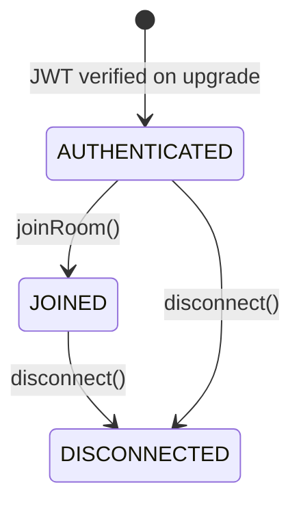
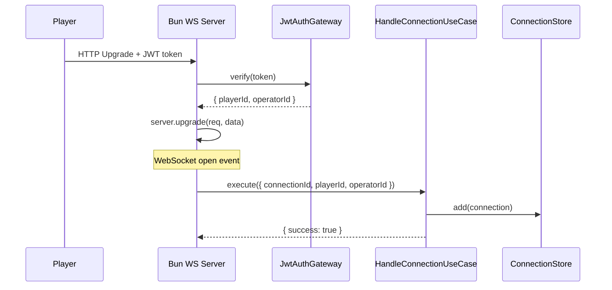
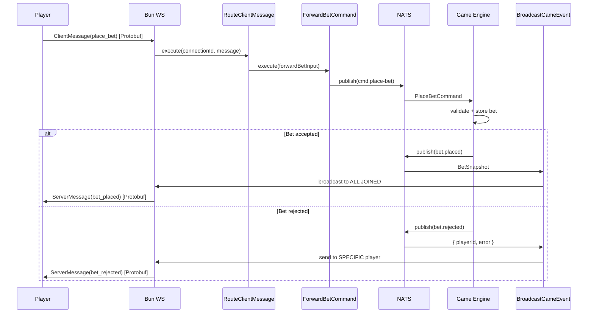
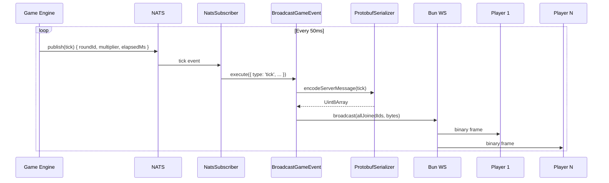
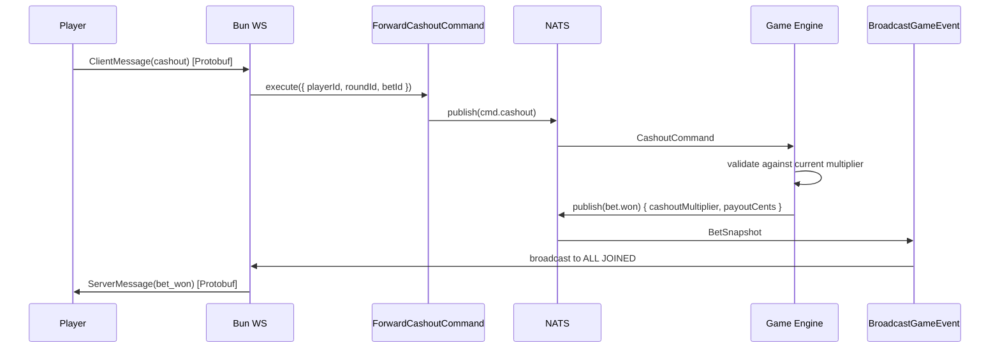
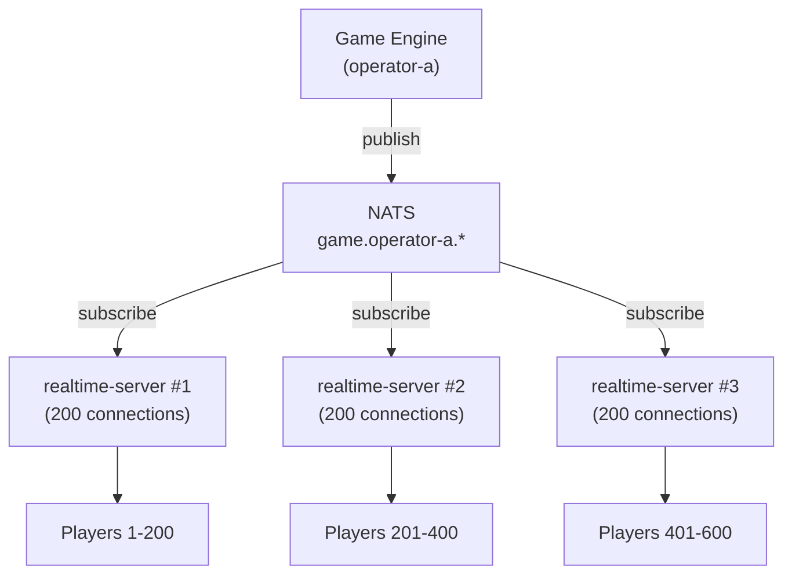

# Realtime Server Architecture — Design & Tasks

WebSocket bridge between browser clients and the crash game engine via NATS.

## 1. Overview & Responsibility

The realtime-server is the **client-facing edge** of the Aviatrix platform. It maintains WebSocket connections with players and translates between the browser wire protocol (Protobuf over WebSocket) and the internal NATS message bus.

**What it does:**
- Accepts WebSocket connections from players, authenticates via JWT on upgrade
- Subscribes to operator-scoped NATS topics published by the game-engine
- Broadcasts game events (ticks, round state, bet confirmations) to connected clients
- Receives player commands (place bet, cashout) via WebSocket, validates, and forwards to NATS
- Tracks connected players and their operator/room membership

**What it does NOT do:**
- Run game logic (no crash point calculation, no RNG, no round state machine)
- Persist data (no database writes — purely stateless bridge)
- Manage wallets or process payments
- Implement social features (Crews, tournaments — those are platform-api concerns)

**Single Responsibility:** Route messages between WebSocket clients and NATS, nothing more.

---

## 2. Architecture Diagram

```mermaid
flowchart LR
    subgraph Clients["Browser Clients"]
        P1["Player 1"]
        P2["Player 2"]
        P3["Player N"]
    end

    subgraph RT["Realtime Server (Bun.js)"]
        WS["Bun WebSocket Server"]
        Auth["JWT Auth"]
        ConnStore["Connection Store"]
        Serializer["Protobuf Serializer"]
        NatsBridge["NATS Bridge"]
    end

    subgraph Bus["NATS JetStream"]
        PubTopics["game.{op}.round.* \n game.{op}.tick \n game.{op}.bet.*"]
        CmdTopics["game.{op}.cmd.place-bet \n game.{op}.cmd.cashout"]
    end

    subgraph Engine["Game Engine"]
        GameLoop["Round State Machine"]
    end

    P1 & P2 & P3 <-->|"Protobuf / WS"| WS
    WS --> Auth
    WS --> ConnStore
    WS <--> Serializer
    Serializer <--> NatsBridge
    NatsBridge -->|subscribe| PubTopics
    NatsBridge -->|publish| CmdTopics
    GameLoop -->|publish| PubTopics
    GameLoop <--|subscribe| CmdTopics
```

---

## 3. Clean Architecture Layer Map

```
apps/realtime-server/
├── src/
│   ├── main.ts                              ← Bootstrap + composition root
│   ├── config/
│   │   ├── config.schema.ts                 ← Zod env validation
│   │   └── RealtimeConfig.ts                ← Domain config interface
│   ├── connection/                           ← CONNECTION bounded context
│   │   ├── domain/
│   │   │   ├── Connection.ts                ← Entity: player session
│   │   │   ├── ConnectionState.ts           ← State machine enum
│   │   │   └── ConnectionId.ts              ← Value object
│   │   ├── application/
│   │   │   ├── ports/
│   │   │   │   ├── ConnectionStore.ts       ← Port: in-memory registry
│   │   │   │   ├── AuthGateway.ts           ← Port: JWT verification
│   │   │   │   └── WebSocketSender.ts       ← Port: send message to client
│   │   │   ├── HandleConnectionUseCase.ts   ← Authenticate + register
│   │   │   └── HandleDisconnectionUseCase.ts← Cleanup
│   │   └── infrastructure/
│   │       ├── InMemoryConnectionStore.ts
│   │       └── JwtAuthGateway.ts
│   ├── messaging/                            ← MESSAGING bounded context
│   │   ├── domain/
│   │   │   ├── ClientMessage.ts             ← Discriminated union (inbound)
│   │   │   ├── ServerMessage.ts             ← Discriminated union (outbound)
│   │   │   └── MessageType.ts              ← Enum of all message types
│   │   ├── application/
│   │   │   ├── ports/
│   │   │   │   ├── MessageBrokerPublisher.ts← Port: publish to NATS
│   │   │   │   ├── MessageBrokerSubscriber.ts← Port: subscribe to NATS
│   │   │   │   ├── MessageSerializer.ts     ← Port: encode/decode Protobuf
│   │   │   │   └── Logger.ts               ← Port: structured logging
│   │   │   ├── ForwardBetCommandUseCase.ts  ← Validate + publish bet cmd
│   │   │   ├── ForwardCashoutCommandUseCase.ts
│   │   │   ├── BroadcastGameEventUseCase.ts ← NATS event → fan-out to WS
│   │   │   └── RouteClientMessageUseCase.ts ← Dispatch inbound WS message
│   │   └── infrastructure/
│   │       ├── NatsPublisher.ts             ← Implements MessageBrokerPublisher
│   │       ├── NatsSubscriber.ts            ← Implements MessageBrokerSubscriber
│   │       ├── ProtobufSerializer.ts        ← Implements MessageSerializer
│   │       ├── topics.ts                    ← Reuse createTopics() pattern
│   │       └── nats-schemas.ts             ← Zod schemas for NATS payloads
│   ├── transport/                            ← TRANSPORT infrastructure
│   │   ├── BunWebSocketServer.ts            ← Bun.serve() + WS handlers
│   │   ├── wsHandlers.ts                    ← Humble handlers (open/message/close)
│   │   └── upgradeHandler.ts               ← HTTP upgrade + JWT extraction
│   └── shared/
│       └── kernel/
│           └── OperatorId.ts                ← Value object
├── proto/
│   ├── client_message.proto                 ← Client → Server schema
│   └── server_message.proto                 ← Server → Client schema
├── test/
│   ├── domain/
│   ├── application/
│   └── integration/
├── package.json
├── tsconfig.json
└── .env.example
```

**Layer rules (same as game-engine):**
- `domain/` — Zero imports from application, infrastructure, or any framework
- `application/` — Imports domain only. Defines port interfaces. No Bun, no NATS, no Protobuf imports
- `infrastructure/` — Implements ports. Only place for Bun, NATS client, Protobuf, JWT libs
- `transport/` — Special infrastructure: Bun WebSocket server (humble object, delegates to use cases)

---

## 4. Domain Layer

### 4.1 Connection Entity

```typescript
// connection/domain/Connection.ts
export class Connection {
  private constructor(
    readonly id: ConnectionId,
    readonly playerId: string,
    readonly operatorId: string,
    private _state: ConnectionState,
    readonly connectedAt: number,
  ) {}

  static create(id: ConnectionId, playerId: string, operatorId: string): Connection {
    return new Connection(id, playerId, operatorId, ConnectionState.AUTHENTICATED, Date.now());
  }

  joinRoom(): void {
    if (this._state !== ConnectionState.AUTHENTICATED) {
      throw new InvalidStateTransition(`Cannot join from ${this._state}`);
    }
    this._state = ConnectionState.JOINED;
  }

  disconnect(): void {
    this._state = ConnectionState.DISCONNECTED;
  }

  get state(): ConnectionState { return this._state; }
  get isJoined(): boolean { return this._state === ConnectionState.JOINED; }
}
```

### 4.2 Connection State Machine

```typescript
// connection/domain/ConnectionState.ts
export enum ConnectionState {
  AUTHENTICATED = 'AUTHENTICATED',   // JWT verified, not yet in room
  JOINED        = 'JOINED',          // In operator room, receiving events
  DISCONNECTED  = 'DISCONNECTED',    // Cleaned up
}
```



### 4.3 Client Messages (Inbound)

```typescript
// messaging/domain/ClientMessage.ts
export type ClientMessage =
  | { readonly type: 'place_bet'; readonly idempotencyKey: string; readonly roundId: string; readonly amountCents: number; readonly autoCashout?: number }
  | { readonly type: 'cashout'; readonly roundId: string; readonly betId: string }
  | { readonly type: 'ping' };
```

### 4.4 Server Messages (Outbound)

```typescript
// messaging/domain/ServerMessage.ts
export type ServerMessage =
  | { readonly type: 'round_new'; readonly roundId: string; readonly hashedSeed: string }
  | { readonly type: 'round_betting'; readonly roundId: string; readonly endsAt: number }
  | { readonly type: 'round_started'; readonly roundId: string }
  | { readonly type: 'round_crashed'; readonly roundId: string; readonly crashPoint: number; readonly serverSeed: string }
  | { readonly type: 'tick'; readonly roundId: string; readonly multiplier: number; readonly elapsedMs: number }
  | { readonly type: 'bet_placed'; readonly betId: string; readonly playerId: string; readonly roundId: string; readonly amountCents: number }
  | { readonly type: 'bet_won'; readonly betId: string; readonly playerId: string; readonly roundId: string; readonly amountCents: number; readonly cashoutMultiplier: number; readonly payoutCents: number }
  | { readonly type: 'bet_lost'; readonly betId: string; readonly playerId: string; readonly roundId: string; readonly amountCents: number; readonly crashPoint: number }
  | { readonly type: 'bet_rejected'; readonly playerId: string; readonly roundId: string; readonly amountCents: number; readonly error: string }
  | { readonly type: 'pong' }
  | { readonly type: 'error'; readonly code: string; readonly message: string };
```

---

## 5. Application Layer — Use Cases

### 5.1 HandleConnectionUseCase

**Trigger:** WebSocket upgrade completes (JWT already verified in transport layer)

```typescript
// Input
interface ConnectInput {
  connectionId: ConnectionId;
  playerId: string;      // extracted from JWT
  operatorId: string;    // extracted from JWT
}

// Output
type ConnectResult =
  | { success: true }
  | { success: false; error: 'OPERATOR_MISMATCH' | 'ALREADY_CONNECTED' };
```

**Flow:** Validate operator matches server's configured operator → create Connection entity → store in ConnectionStore → mark JOINED.

### 5.2 HandleDisconnectionUseCase

**Trigger:** WebSocket `close` event

```typescript
interface DisconnectInput {
  connectionId: ConnectionId;
}
```

**Flow:** Retrieve connection → call `disconnect()` → remove from ConnectionStore.

### 5.3 ForwardBetCommandUseCase

**Trigger:** Client sends `place_bet` message

```typescript
interface ForwardBetInput {
  playerId: string;
  idempotencyKey: string;
  roundId: string;
  amountCents: number;
  autoCashout?: number;
}

type ForwardBetResult =
  | { success: true }
  | { success: false; error: 'INVALID_AMOUNT' | 'NOT_JOINED' };
```

**Flow:** Validate input (amountCents > 0, player is JOINED) → publish to NATS `cmd.place-bet` topic. Result confirmation comes asynchronously via NATS `bet.placed` or `bet.rejected` event.

### 5.4 ForwardCashoutCommandUseCase

**Trigger:** Client sends `cashout` message

```typescript
interface ForwardCashoutInput {
  playerId: string;
  roundId: string;
  betId: string;
}
```

**Flow:** Validate player is JOINED → publish to NATS `cmd.cashout` topic. Confirmation comes asynchronously via `bet.won` event.

### 5.5 BroadcastGameEventUseCase

**Trigger:** NATS event received (tick, round state change, bet event)

```typescript
interface BroadcastInput {
  serverMessage: ServerMessage;
  targetPlayerId?: string;  // undefined = broadcast to all
}
```

**Flow:** If `targetPlayerId` is set (e.g., `bet_rejected` is player-specific) → send to that connection only. Otherwise → fan-out to all JOINED connections via ConnectionStore. Serialize with MessageSerializer before sending.

**Routing rules:**
| NATS Event | Target | Notes |
|------------|--------|-------|
| `tick` | All JOINED | Hot path — most frequent |
| `round.*` | All JOINED | Round lifecycle |
| `bet.placed` | All JOINED | All players see all bets |
| `bet.won` | All JOINED | All players see cashouts |
| `bet.lost` | All JOINED | All players see losses |
| `bet.rejected` | Specific player | Only the player who placed the rejected bet |
| `credit.failed` | Specific player | Only the affected player |

### 5.6 RouteClientMessageUseCase

**Trigger:** WebSocket `message` event (after deserialization)

```typescript
interface RouteInput {
  connectionId: ConnectionId;
  message: ClientMessage;
}
```

**Flow:** Switch on `message.type`:
- `place_bet` → delegate to ForwardBetCommandUseCase
- `cashout` → delegate to ForwardCashoutCommandUseCase
- `ping` → respond with `pong` directly

---

## 6. Application Layer — Port Interfaces

```typescript
// connection/application/ports/ConnectionStore.ts
export interface ConnectionStore {
  add(connection: Connection): void;
  remove(id: ConnectionId): void;
  getById(id: ConnectionId): Connection | undefined;
  getByPlayerId(playerId: string): Connection | undefined;
  getAllJoined(): Connection[];
  count(): number;
}

// connection/application/ports/AuthGateway.ts
export interface AuthPayload {
  playerId: string;
  operatorId: string;
}

export interface AuthGateway {
  verify(token: string): AuthPayload | null;
}

// connection/application/ports/WebSocketSender.ts
export interface WebSocketSender {
  send(connectionId: ConnectionId, data: Uint8Array): void;
  broadcast(connectionIds: ConnectionId[], data: Uint8Array): void;
  close(connectionId: ConnectionId, code?: number, reason?: string): void;
}

// messaging/application/ports/MessageBrokerPublisher.ts
export interface MessageBrokerPublisher {
  publishPlaceBet(payload: {
    idempotencyKey: string;
    playerId: string;
    roundId: string;
    amountCents: number;
    autoCashout?: number;
  }): void;

  publishCashout(payload: {
    playerId: string;
    roundId: string;
    betId: string;
  }): void;
}

// messaging/application/ports/MessageBrokerSubscriber.ts
export interface MessageBrokerSubscriber {
  onRoundNew(handler: (data: { roundId: string; hashedSeed: string }) => void): void;
  onRoundBetting(handler: (data: { roundId: string; endsAt: number }) => void): void;
  onRoundStarted(handler: (data: { roundId: string }) => void): void;
  onRoundCrashed(handler: (data: { roundId: string; crashPoint: number; serverSeed: string }) => void): void;
  onTick(handler: (data: { roundId: string; multiplier: number; elapsedMs: number }) => void): void;
  onBetPlaced(handler: (data: BetSnapshot) => void): void;
  onBetWon(handler: (data: BetSnapshot) => void): void;
  onBetLost(handler: (data: BetSnapshot & { crashPoint: number }) => void): void;
  onBetRejected(handler: (data: { playerId: string; roundId: string; amountCents: number; error: string }) => void): void;
  onCreditFailed(handler: (data: { playerId: string; betId: string; roundId: string; payoutCents: number; reason: string }) => void): void;
  close(): Promise<void>;
}

// messaging/application/ports/MessageSerializer.ts
export interface MessageSerializer {
  encodeServerMessage(message: ServerMessage): Uint8Array;
  decodeClientMessage(data: Uint8Array): ClientMessage;
}

// messaging/application/ports/Logger.ts
export interface Logger {
  info(message: string, context?: Record<string, unknown>): void;
  warn(message: string, context?: Record<string, unknown>): void;
  error(message: string, context?: Record<string, unknown>): void;
}
```

---

## 7. Infrastructure Layer — Adapters

### 7.1 BunWebSocketServer (Humble Object)

The transport layer is a **humble object** — it contains zero business logic. It deserializes, delegates to use cases, and serializes responses.

```typescript
// transport/BunWebSocketServer.ts (simplified)
Bun.serve({
  port: config.wsPort,

  fetch(req, server) {
    // Extract JWT from query string or header
    const token = extractToken(req);
    const auth = authGateway.verify(token);
    if (!auth) return new Response('Unauthorized', { status: 401 });

    // Upgrade with auth payload attached
    server.upgrade(req, { data: { playerId: auth.playerId, operatorId: auth.operatorId } });
  },

  websocket: {
    open(ws) {
      const connId = ConnectionId.generate();
      ws.data.connectionId = connId;
      handleConnectionUseCase.execute({ connectionId: connId, playerId: ws.data.playerId, operatorId: ws.data.operatorId });
    },

    message(ws, raw) {
      const msg = messageSerializer.decodeClientMessage(raw);
      routeClientMessageUseCase.execute({ connectionId: ws.data.connectionId, message: msg });
    },

    close(ws) {
      handleDisconnectionUseCase.execute({ connectionId: ws.data.connectionId });
    },
  },
});
```

### 7.2 NatsPublisher / NatsSubscriber

Mirrors game-engine's pattern: `safePublish` (JSON encode, catch errors, log), Zod schemas on inbound messages.

### 7.3 ProtobufSerializer

Implements `MessageSerializer` port using generated Protobuf classes from `.proto` files.

### 7.4 InMemoryConnectionStore

`Map<string, Connection>` with secondary index `Map<playerId, ConnectionId>` for player lookups.

### 7.5 JwtAuthGateway

Verifies JWT using shared secret or public key. Extracts `playerId` and `operatorId` claims.

---

## 8. Protobuf Wire Protocol

### 8.1 `proto/client_message.proto`

```protobuf
syntax = "proto3";
package aviatrix.realtime;

message ClientMessage {
  oneof payload {
    PlaceBet place_bet = 1;
    Cashout cashout = 2;
    Ping ping = 3;
  }
}

message PlaceBet {
  string idempotency_key = 1;
  string round_id = 2;
  int32 amount_cents = 3;
  optional double auto_cashout = 4;
}

message Cashout {
  string round_id = 1;
  string bet_id = 2;
}

message Ping {}
```

### 8.2 `proto/server_message.proto`

```protobuf
syntax = "proto3";
package aviatrix.realtime;

message ServerMessage {
  oneof payload {
    RoundNew round_new = 1;
    RoundBetting round_betting = 2;
    RoundStarted round_started = 3;
    RoundCrashed round_crashed = 4;
    Tick tick = 5;
    BetPlaced bet_placed = 6;
    BetWon bet_won = 7;
    BetLost bet_lost = 8;
    BetRejected bet_rejected = 9;
    Pong pong = 10;
    Error error = 11;
  }
}

message RoundNew {
  string round_id = 1;
  string hashed_seed = 2;
}

message RoundBetting {
  string round_id = 1;
  int64 ends_at = 2;
}

message RoundStarted {
  string round_id = 1;
}

message RoundCrashed {
  string round_id = 1;
  double crash_point = 2;
  string server_seed = 3;
}

message Tick {
  string round_id = 1;
  double multiplier = 2;
  int32 elapsed_ms = 3;
}

message BetPlaced {
  string bet_id = 1;
  string player_id = 2;
  string round_id = 3;
  int32 amount_cents = 4;
}

message BetWon {
  string bet_id = 1;
  string player_id = 2;
  string round_id = 3;
  int32 amount_cents = 4;
  double cashout_multiplier = 5;
  int32 payout_cents = 6;
}

message BetLost {
  string bet_id = 1;
  string player_id = 2;
  string round_id = 3;
  int32 amount_cents = 4;
  double crash_point = 5;
}

message BetRejected {
  string player_id = 1;
  string round_id = 2;
  int32 amount_cents = 3;
  string error = 4;
}

message Pong {}

message Error {
  string code = 1;
  string message = 2;
}
```

---

## 9. Data Flow Diagrams

### 9.1 Player Connects



### 9.2 Player Places Bet



### 9.3 Multiplier Tick Broadcast



### 9.4 Player Cashout



### 9.5 Horizontal Scaling (NATS Fan-Out)



All instances subscribe to the same NATS topics. NATS delivers every message to every subscriber. Each instance only broadcasts to its own connected clients.

---

## 10. Configuration

### 10.1 Zod Schema

```typescript
// config/config.schema.ts
import { z } from 'zod';

export const realtimeConfigSchema = z.object({
  OPERATOR_ID: z.string().min(3).regex(/^[a-z][a-z0-9]+(-[a-z0-9]+)*$/),
  WS_PORT: z.coerce.number().int().min(1024).max(65535).default(8080),
  NATS_URL: z.string().url().default('nats://localhost:4222'),
  JWT_SECRET: z.string().min(32),
  MAX_CONNECTIONS: z.coerce.number().int().positive().default(10000),
  LOG_LEVEL: z.enum(['debug', 'info', 'warn', 'error']).default('info'),
});

export type RawRealtimeConfig = z.infer<typeof realtimeConfigSchema>;
```

### 10.2 Domain Config Interface

```typescript
// config/RealtimeConfig.ts (no Zod import)
export interface RealtimeConfig {
  operatorId: string;
  wsPort: number;
  maxConnections: number;
}
```

### 10.3 `.env.example`

```env
OPERATOR_ID=operator-a
WS_PORT=8080
NATS_URL=nats://localhost:4222
JWT_SECRET=your-secret-key-min-32-characters-long
MAX_CONNECTIONS=10000
LOG_LEVEL=info
```

---

## 11. Scaling & Deployment

### 11.1 Scaling Strategy

| Layer | Strategy | Mechanism |
|-------|----------|-----------|
| Game Engine | Vertical | Single-threaded tick loop |
| **Realtime Server** | **Horizontal** | NATS fan-out to N instances |
| Platform API | Horizontal | Stateless REST |

### 11.2 Operator Isolation

Each realtime-server instance serves exactly one operator (configured via `OPERATOR_ID`). Deployment:

```
operator-a-realtime-1  →  subscribes to game.operator-a.*
operator-a-realtime-2  →  subscribes to game.operator-a.*
operator-b-realtime-1  →  subscribes to game.operator-b.*
```

### 11.3 Health Check

```typescript
// Exposed on HTTP (same Bun.serve, different path)
// GET /health → { status: 'ok', connections: 342, nats: 'connected' }
```

### 11.4 Graceful Shutdown

```
SIGTERM received
  → Stop accepting new WebSocket connections
  → Close all existing connections with code 1001 (Going Away)
  → Drain NATS subscriptions
  → Exit
```

### 11.5 Docker

```dockerfile
FROM oven/bun:1-alpine
WORKDIR /app
COPY package.json bun.lock ./
RUN bun install --frozen-lockfile --production
COPY src/ src/
COPY proto/ proto/
EXPOSE 8080
CMD ["bun", "run", "src/main.ts"]
```

---

## 12. Task Breakdown

### Dependency Graph

```
RT-1 Scaffold ──→ RT-2 Domain + Application ──→ RT-3 WebSocket Transport ──→ RT-5 Integration
                                               ──→ RT-4 NATS Bridge       ──→ RT-5
```

---

### Phase RT-1: Scaffold & Config

| ID | Task | Files | Acceptance Criteria | Deps | Size |
|----|------|-------|---------------------|------|------|
| RT-1.1 | Initialize `apps/realtime-server/` | `package.json`, `tsconfig.json`, `.env.example`, all `src/` directory stubs, `test/` dirs | `bun install` succeeds; dir structure matches architecture doc; `turbo build` includes realtime-server | — | S |
| RT-1.2 | Configure TypeScript strict + path aliases | `tsconfig.json` | `strict: true`; path aliases `@connection/`, `@messaging/`, `@transport/`, `@shared/`, `@config/` resolve; `bun run typecheck` passes | RT-1.1 | S |
| RT-1.3 | Config module + Zod schema | `src/config/config.schema.ts`, `src/config/RealtimeConfig.ts` | Validates env via Zod at startup; missing `JWT_SECRET` = clear error with var name; exports `RawRealtimeConfig` and domain `RealtimeConfig` | RT-1.1 | S |
| RT-1.4 | NATS topic constants | `src/messaging/infrastructure/topics.ts` | Reuses `GameTopics` interface and `createTopics(operatorId)` pattern from game-engine; operator-prefixed topics | RT-1.1 | S |
| RT-1.5 | Protobuf schema definition | `proto/client_message.proto`, `proto/server_message.proto` | `.proto` files compile with `protoc` or `buf`; covers all message types from Section 8; generates TypeScript bindings | RT-1.1 | M |
| RT-1.6 | Test runner setup | `vitest.config.ts` or bun test config | `bun test test/domain/` runs; coverage works | RT-1.1 | S |

---

### Phase RT-2: Domain & Application Layer

**Rule: ZERO framework imports. Pure TypeScript only.**

```
Parallel tracks:
  A: RT-2.1 → RT-2.2 → RT-2.3 → RT-2.7 → RT-2.8 (connection context)
  B: RT-2.4 → RT-2.5 → RT-2.6 → RT-2.9 → RT-2.10 → RT-2.11 (messaging context)
```

| ID | Task | Files | Acceptance Criteria | Deps | Size |
|----|------|-------|---------------------|------|------|
| RT-2.1 | `ConnectionId` value object | `src/connection/domain/ConnectionId.ts`, test | `ConnectionId.generate()` returns unique ID; equality by value; zero npm imports | RT-1.6 | S |
| RT-2.2 | `ConnectionState` enum + transitions | `src/connection/domain/ConnectionState.ts`, test | `AUTHENTICATED → JOINED → DISCONNECTED`; `canTransition(from, to)` pure function | RT-1.1 | S |
| RT-2.3 | `Connection` entity | `src/connection/domain/Connection.ts`, test | Factory `Connection.create()`; `joinRoom()`, `disconnect()` enforce state transitions; rejects invalid transitions; zero npm imports | RT-2.1, RT-2.2 | S |
| RT-2.4 | `ClientMessage` discriminated union | `src/messaging/domain/ClientMessage.ts` | `place_bet`, `cashout`, `ping` variants; readonly properties; TypeScript exhaustiveness checkable | RT-1.1 | S |
| RT-2.5 | `ServerMessage` discriminated union | `src/messaging/domain/ServerMessage.ts` | All 11 variants matching Section 4.4; readonly properties | RT-1.1 | S |
| RT-2.6 | Port interfaces (all) | `src/connection/application/ports/*.ts`, `src/messaging/application/ports/*.ts` | All 7 port interfaces from Section 6 defined; zero framework imports; `grep -r "bun\|nats\|protobuf\|jsonwebtoken" src/*/application/` = 0 | RT-2.3, RT-2.4, RT-2.5 | M |
| RT-2.7 | `HandleConnectionUseCase` | `src/connection/application/HandleConnectionUseCase.ts`, test | Creates Connection; stores in ConnectionStore; rejects operator mismatch; tests use mock ports | RT-2.3, RT-2.6 | S |
| RT-2.8 | `HandleDisconnectionUseCase` | `src/connection/application/HandleDisconnectionUseCase.ts`, test | Retrieves connection; calls disconnect(); removes from store; no-op if already disconnected | RT-2.3, RT-2.6 | S |
| RT-2.9 | `ForwardBetCommandUseCase` | `src/messaging/application/ForwardBetCommandUseCase.ts`, test | Validates amountCents > 0; verifies player JOINED via ConnectionStore; publishes to MessageBrokerPublisher; returns result union | RT-2.6 | S |
| RT-2.10 | `ForwardCashoutCommandUseCase` | `src/messaging/application/ForwardCashoutCommandUseCase.ts`, test | Verifies player JOINED; publishes to MessageBrokerPublisher; tests verify NATS payload shape | RT-2.6 | S |
| RT-2.11 | `BroadcastGameEventUseCase` | `src/messaging/application/BroadcastGameEventUseCase.ts`, test | Routes player-specific events (bet_rejected, credit_failed) to single connection; broadcasts all others to ALL JOINED; uses MessageSerializer + WebSocketSender ports | RT-2.5, RT-2.6 | M |
| RT-2.12 | `RouteClientMessageUseCase` | `src/messaging/application/RouteClientMessageUseCase.ts`, test | Switches on `message.type`; delegates to ForwardBet/ForwardCashout/responds pong; tests verify correct delegation | RT-2.9, RT-2.10, RT-2.11 | S |
| RT-2.13 | Domain purity verification | CI script or test | `grep -r "@Injectable\|@Inject\|@Module\|nestjs\|bun\|nats\|protobuf" src/*/domain/ src/*/application/` = 0 matches | RT-2.1–RT-2.12 | S |

---

### Phase RT-3: Infrastructure — WebSocket Transport

| ID | Task | Files | Acceptance Criteria | Deps | Size |
|----|------|-------|---------------------|------|------|
| RT-3.1 | `JwtAuthGateway` | `src/connection/infrastructure/JwtAuthGateway.ts`, test | Implements `AuthGateway` port; verifies JWT; extracts `playerId` + `operatorId` claims; returns `null` on invalid/expired token | RT-2.6 | S |
| RT-3.2 | `InMemoryConnectionStore` | `src/connection/infrastructure/InMemoryConnectionStore.ts`, test | Implements `ConnectionStore`; `Map<string, Connection>` + `Map<playerId, ConnectionId>` secondary index; `getAllJoined()` filters by state; `count()` returns total | RT-2.6 | S |
| RT-3.3 | `ProtobufSerializer` | `src/messaging/infrastructure/ProtobufSerializer.ts`, test | Implements `MessageSerializer`; uses generated Protobuf classes from RT-1.5; encode/decode round-trips correctly for all message types | RT-1.5, RT-2.6 | M |
| RT-3.4 | `BunWebSocketServer` + handlers | `src/transport/BunWebSocketServer.ts`, `src/transport/wsHandlers.ts`, `src/transport/upgradeHandler.ts` | `Bun.serve()` on configured port; HTTP upgrade extracts JWT → auth; `open` → HandleConnectionUseCase; `message` → deserialize + RouteClientMessage; `close` → HandleDisconnection; handlers are humble (no logic) | RT-3.1, RT-3.2, RT-3.3 | M |
| RT-3.5 | `WebSocketSenderAdapter` | `src/transport/WebSocketSenderAdapter.ts` | Implements `WebSocketSender` port; wraps Bun's `ws.send()` and `ws.close()`; maintains `Map<ConnectionId, ServerWebSocket>` for lookups; `broadcast()` iterates and sends binary | RT-2.6 | S |
| RT-3.6 | Health check endpoint | `src/transport/BunWebSocketServer.ts` (extend) | `GET /health` returns `{ status, connections, nats, uptime }`; non-WS HTTP requests get 404 | RT-3.4 | S |

---

### Phase RT-4: Infrastructure — NATS Bridge

| ID | Task | Files | Acceptance Criteria | Deps | Size |
|----|------|-------|---------------------|------|------|
| RT-4.1 | Zod schemas for NATS payloads | `src/messaging/infrastructure/nats-schemas.ts` | Zod schemas for all 10 inbound NATS event payloads (round.new, tick, bet.placed, etc.); matches game-engine's NatsEventPublisher output shapes exactly | RT-1.4 | M |
| RT-4.2 | `NatsPublisher` | `src/messaging/infrastructure/NatsPublisher.ts`, test | Implements `MessageBrokerPublisher`; `safePublish()` pattern (JSON encode, catch errors, log); publishes to `cmd.place-bet` and `cmd.cashout` topics | RT-1.4, RT-2.6 | S |
| RT-4.3 | `NatsSubscriber` | `src/messaging/infrastructure/NatsSubscriber.ts`, test | Implements `MessageBrokerSubscriber`; subscribes to all 10 event topics; Zod validates each payload (anti-corruption layer); on valid event → calls handler; on invalid → logs + drops | RT-4.1, RT-2.6 | M |
| RT-4.4 | NATS connection + reconnection | `src/messaging/infrastructure/nats-connection.ts` | Connect to NATS_URL; auto-reconnect on disconnect; log connection status changes; expose `isConnected()` for health check | RT-1.3 | S |
| RT-4.5 | Wire NATS events → BroadcastGameEvent | `src/main.ts` (extend) | NatsSubscriber handlers invoke BroadcastGameEventUseCase with correctly mapped ServerMessage types; all 10 NATS events covered | RT-4.3, RT-2.11 | M |

---

### Phase RT-5: Integration & Verification

| ID | Task | Files | Acceptance Criteria | Deps | Size |
|----|------|-------|---------------------|------|------|
| RT-5.1 | Composition root (`main.ts`) | `src/main.ts` | Validates config → creates all infrastructure instances → wires ports to use cases → starts WS server → subscribes to NATS; graceful shutdown on SIGTERM/SIGINT | All RT-3, RT-4 | M |
| RT-5.2 | Full round lifecycle E2E | `test/integration/round-lifecycle.spec.ts` | Connect WS client → receive round.new → place bet → receive bet.placed → receive ticks → cashout → receive bet.won → receive round.crashed; requires Docker NATS + game-engine running | RT-5.1 | L |
| RT-5.3 | Connection lifecycle test | `test/integration/connection.spec.ts` | Connect with valid JWT → joined; connect with invalid JWT → rejected (401); connect then disconnect → cleaned up; reconnect → works | RT-5.1 | M |
| RT-5.4 | Protobuf round-trip test | `test/integration/protobuf.spec.ts` | Every ClientMessage variant encodes → decodes correctly; every ServerMessage variant encodes → decodes correctly; binary size < JSON equivalent | RT-3.3 | S |
| RT-5.5 | Load test: concurrent connections | `test/integration/load.spec.ts` | 1000 concurrent WebSocket connections; each receives tick broadcast < 20ms after NATS publish; no connection drops; memory stable | RT-5.1 | L |
| RT-5.6 | Graceful shutdown test | `test/integration/shutdown.spec.ts` | SIGTERM → all clients receive close frame (1001) → NATS drained → process exits cleanly | RT-5.1 | M |
| RT-5.7 | Domain purity verification (final) | CI script | `grep -r "bun\|nats\|protobuf\|jsonwebtoken" src/*/domain/ src/*/application/` = 0; all domain + application tests pass without infrastructure | All | S |

---

## 13. Sprint Plan

| Sprint | Days | Tasks | Milestone |
|--------|------|-------|-----------|
| **1** | 1-2 | RT-1.1–RT-1.6 | Project scaffold + config + Protobuf schemas |
| **2** | 3-5 | RT-2.1–RT-2.6 | Domain entities + all port interfaces |
| **3** | 6-7 | RT-2.7–RT-2.13 | All use cases + domain purity verified |
| **4** | 8-10 | RT-3.1–RT-3.6 | WebSocket server functional |
| **5** | 11-13 | RT-4.1–RT-4.5 | NATS bridge + event broadcasting |
| **6** | 14-16 | RT-5.1–RT-5.7 | Integration verified, load tested |

**Total: 35 tasks, ~14-18 working days**

---

## 14. Sync Points with Other Services

| Sync Point | When | Teams | Deliverable |
|------------|------|-------|-------------|
| **SP-1: Protobuf schema lock** | After RT-1.5 | Realtime + Frontend | Agreed `.proto` files in `packages/shared/proto/` |
| **SP-2: NATS topic contract** | After RT-1.4 | Realtime + Game Engine | Verified topic names + JSON payload shapes match |
| **SP-3: JWT format agreement** | After RT-3.1 | Realtime + Platform API | JWT claims (`playerId`, `operatorId`, `exp`), signing algorithm, key rotation |
| **SP-4: End-to-end integration** | After RT-5.2 | All three engineers | Full bet→cashout flow: Frontend → WS → NATS → Engine → NATS → WS → Frontend |

---

## 15. Clean Architecture Compliance Checklist

| Principle | How Applied |
|-----------|-------------|
| `dep-inward-only` | Domain imports nothing. Application imports domain only. Infrastructure imports all. |
| `dep-interface-ownership` | Ports defined in `application/ports/`, implemented in `infrastructure/` |
| `bound-humble-object` | `BunWebSocketServer` + handlers contain zero logic — deserialize, delegate, serialize |
| `frame-web-in-infrastructure` | Bun WebSocket is an infrastructure detail in `transport/` |
| `adapt-anti-corruption-layer` | Zod schemas validate all inbound NATS payloads and client messages |
| `comp-screaming-architecture` | Folder structure says "connections and messaging", not "Bun app" |
| `usecase-input-output-ports` | Every use case has typed input + discriminated union result |
| `bound-service-internal-architecture` | Full clean architecture internally despite being a microservice |
