# Aviatrix Platform Architecture

High-level technical architecture for the Aviatrix social crash gaming platform.

## Architecture Diagram

```mermaid
flowchart TB
    subgraph External["External Actors"]
        Players["👤 Players"]
        Telegram["📱 Telegram"]
        Streamers["🎮 Streamers"]
        Operators["🏢 Operators"]
    end

    subgraph Frontend["🔵 Frontend Layer"]
        React["React 19 + TypeScript"]
        PixiJS["PixiJS 8"]
        ThreeJS["Three.js"]
        Rive["Rive"]
        Zustand["Zustand"]
        Vite["Vite"]
    end

    subgraph Realtime["🟢 Realtime Layer"]
        uWS["µWebSockets"]
        NATS["NATS JetStream"]
        Redis["Redis 7"]
        WebRTC["WebRTC"]
        Protobuf["Protocol Buffers"]
    end

    subgraph Engine["🟠 Game Engine (Hot Path)"]
        Bun["Bun.js"]
        TS["TypeScript"]
        PF["Provably Fair SHA-512"]
        RNG["Isolated RNG Module"]
        StateMachine["Round State Machine"]
    end

    subgraph Platform["🟣 Platform / API"]
        NestJS["NestJS"]
        GraphQL["GraphQL"]
        REST["REST + OpenAPI 3.1"]
        WalletSDK["Wallet Adapter SDK"]
        Webhooks["Webhook Event Bus"]
        TelegramAPI["Telegram Bot API"]
    end

    subgraph Data["🔴 Data Layer"]
        PostgreSQL["PostgreSQL 16"]
        ClickHouse["ClickHouse"]
        RedisCache["Redis 7 Cache"]
        NATSStream["NATS JetStream"]
        S3["S3"]
    end

    subgraph Infra["🟡 Infrastructure"]
        K8s["Kubernetes EKS/GKE"]
        Cloudflare["Cloudflare"]
        Terraform["Terraform"]
        GitHub["GitHub Actions"]
        Grafana["Grafana + Loki + Tempo"]
        Unleash["Feature Flags Unleash"]
    end

    subgraph Compliance["⚪ Compliance"]
        GLI["GLI-certified RNG"]
        JurisdictionConfig["Per-jurisdiction Config"]
        ResponsibleGaming["Responsible Gaming SDK"]
        KYC["GeoIP + KYC Adapter"]
        AuditTrail["Immutable Audit Trail"]
    end

    %% External connections
    Players -->|WebSocket| Frontend
    Telegram -->|Bot API| Platform
    Streamers -->|RTMP/WebRTC| Realtime
    Operators -->|REST/Webhook| Platform

    %% Layer connections
    Frontend --> Realtime
    Realtime --> Engine
    Engine --> Platform
    Platform --> Data
    Data --> Infra
    Infra --> Compliance

    %% Cross-layer connections
    Realtime -.-> Data
    Engine -.-> Data
    Platform -.-> Compliance
```

## Data Flow Diagram

## Component Relationships

## Technology Stack Summary

| Layer | Primary Tech | Purpose |
|-------|--------------|---------|
| Frontend | React 19, PixiJS 8, Three.js | Player UI, 2D/3D rendering |
| Realtime | µWebSockets, NATS JetStream | WebSocket connections, pub/sub |
| Game Engine | Bun.js, TypeScript | Core crash logic, hot path |
| Platform | NestJS, TypeScript | API gateway, social features |
| Data | PostgreSQL, ClickHouse | Transactions, analytics |
| Infra | Kubernetes, Cloudflare | Deployment, edge compute |
| Compliance | GLI RNG, Feature Flags | Regulatory, per-jurisdiction config |

## Key Architectural Decisions

1. **Bun.js for hot path** — Native TypeScript runtime with built-in WebSocket support, fast startup, unified codebase
2. **NATS JetStream** — Multi-channel social topology for Crews, tournaments, Copy-Bet
3. **Adaptive rendering** — Auto-detect device: 3D → 2.5D → 2D sprite fallback
4. **Feature flags per jurisdiction** — Single codebase, infinite market configurations
